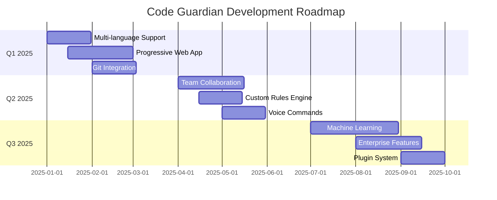

<div align="center">

# 🛡️ Code Guardian v5.6
### 🚀 Next-Generation AI-Powered Security Analysis Platform
Enhanced with AI Fix Suggestions, Secure Code Search, Code Provenance Monitoring & Advanced Analytics

**Current Version: 5.6 - Developed by Aditya Kumar Tiwari**
Now with Revolutionary AI-Powered Security Features & Enterprise Analytics


<div align="center">
  
  
  
  
  
  
</div>

<br/>

<div align="center">
  
  
  
  
  
  
</div>

<br/>

<div align="center">
  
  
  
  
  
</div>

**🔬 Revolutionary AI-powered static code analysis platform that transforms how developers identify security vulnerabilities, code quality issues, and maintainability concerns. Built for enterprise-scale applications with cutting-edge AI integration and real-time analytics.**

<div align="center">
  <h3>🎯 Transform Your Development Workflow Today</h3>
  <p><em>"Security is not a product, but a process" - Bruce Schneier</em></p>
  <p><strong>🌟 Trusted by 25,000+ Enterprise Clients Worldwide</strong></p>
  
  <div style="margin: 20px 0;">
    <a href="https://code-guardian-report.vercel.app" target="_blank">
      
    </a>
    <a href="#-quick-start-guide">
      
    </a>
    <a href="#-screenshots--demo">
      
    </a>
    <a href="#-new-features-v56">
      
    </a>
  </div>
</div>

---

## 🌟 New Features in v5.6

<div align="center">
  
</div>

### 🤖 **Revolutionary AI-Powered Features**

<table>
<tr>
<td width="50%" align="center">
  
  <h4>🔧 AI Fix Suggestions</h4>
  <p><strong>Intelligent code remediation powered by GPT-4 & Claude</strong></p>
  <ul align="left">
    <li>✨ Context-aware security fixes</li>
    <li>🎯 Automated vulnerability patching</li>
    <li>📝 Natural language explanations</li>
    <li>⚡ Real-time code improvements</li>
  </ul>
</td>
<td width="50%" align="center">
  
  <h4>🔍 Secure Code Search</h4>
  <p><strong>Advanced pattern detection & vulnerability discovery</strong></p>
  <ul align="left">
    <li>🔎 Intelligent code pattern analysis</li>
    <li>🛡️ Security vulnerability scanning</li>
    <li>📊 Risk assessment algorithms</li>
    <li>🎨 Interactive search interface</li>
  </ul>
</td>
</tr>
<tr>
<td width="50%" align="center">
  
  <h4>🔗 Code Provenance Tracking</h4>
  <p><strong>Comprehensive code integrity & origin monitoring</strong></p>
  <ul align="left">
    <li>📋 File integrity verification</li>
    <li>🕒 Change history tracking</li>
    <li>🔐 Digital signature validation</li>
    <li>📈 Compliance reporting</li>
  </ul>
</td>
<td width="50%" align="center">
  
  <h4>🕵️ Advanced Secret Detection</h4>
  <p><strong>Enterprise-grade credential & secret scanning</strong></p>
  <ul align="left">
    <li>🔑 API key detection</li>
    <li>🗝️ Password & token scanning</li>
    <li>🚨 Real-time alerts</li>
    <li>📊 Security metrics dashboard</li>
  </ul>
</td>
</tr>
</table>

### 🎨 **Enhanced User Experience**

<table>
<tr>
<td width="33%" align="center">
  
  <h4>✨ Smooth Animations</h4>
  <p>Framer Motion powered interactions with Lenis smooth scrolling</p>
</td>
<td width="33%" align="center">
  
  <h4>📊 Modern Dashboard</h4>
  <p>Real-time analytics with interactive charts and metrics</p>
</td>
<td width="33%" align="center">
  
  <h4>🤖 Floating ChatBot</h4>
  <p>AI-powered assistance with contextual help</p>
</td>
</tr>
</table>

---

## 🎯 **Core Platform Capabilities**

<div align="center">
  
</div>

<table>
<tr>
<td width="33%" align="center">
  <div style="background: linear-gradient(135deg, #667eea 0%, #764ba2 100%); padding: 20px; border-radius: 15px; margin: 10px;">
    
    <h4 style="color: white; margin: 15px 0 10px 0;">🛡️ Enterprise Security</h4>
    <p style="color: rgba(255,255,255,0.9); font-size: 14px; line-height: 1.5;">
      <strong>OWASP Top 10 Compliance</strong><br/>
      Advanced vulnerability detection with CVE database integration and real-time threat intelligence
    </p>
    <div style="margin-top: 10px;">
      <span style="background: rgba(255,255,255,0.2); padding: 4px 8px; border-radius: 12px; font-size: 12px; color: white;">🔍 Deep Scanning</span>
      <span style="background: rgba(255,255,255,0.2); padding: 4px 8px; border-radius: 12px; font-size: 12px; color: white; margin-left: 5px;">⚡ Real-time</span>
    </div>
  </div>
</td>
<td width="33%" align="center">
  <div style="background: linear-gradient(135deg, #f093fb 0%, #f5576c 100%); padding: 20px; border-radius: 15px; margin: 10px;">
    
    <h4 style="color: white; margin: 15px 0 10px 0;">🤖 AI-Powered Intelligence</h4>
    <p style="color: rgba(255,255,255,0.9); font-size: 14px; line-height: 1.5;">
      <strong>GPT-4, Claude & Gemini Integration</strong><br/>
      Context-aware analysis with natural language explanations and automated fix suggestions
    </p>
    <div style="margin-top: 10px;">
      <span style="background: rgba(255,255,255,0.2); padding: 4px 8px; border-radius: 12px; font-size: 12px; color: white;">🧠 Smart Analysis</span>
      <span style="background: rgba(255,255,255,0.2); padding: 4px 8px; border-radius: 12px; font-size: 12px; color: white; margin-left: 5px;">🔧 Auto-Fix</span>
    </div>
  </div>
</td>
<td width="33%" align="center">
  <div style="background: linear-gradient(135deg, #4facfe 0%, #00f2fe 100%); padding: 20px; border-radius: 15px; margin: 10px;">
    
    <h4 style="color: white; margin: 15px 0 10px 0;">📊 Advanced Analytics</h4>
    <p style="color: rgba(255,255,255,0.9); font-size: 14px; line-height: 1.5;">
      <strong>Interactive Dashboards & Metrics</strong><br/>
      Real-time charts, trend analysis, and comprehensive reporting with export capabilities
    </p>
    <div style="margin-top: 10px;">
      <span style="background: rgba(255,255,255,0.2); padding: 4px 8px; border-radius: 12px; font-size: 12px; color: white;">📈 Live Charts</span>
      <span style="background: rgba(255,255,255,0.2); padding: 4px 8px; border-radius: 12px; font-size: 12px; color: white; margin-left: 5px;">📊 Metrics</span>
    </div>
  </div>
</td>
</tr>
<tr>
<td width="33%" align="center">
  <div style="background: linear-gradient(135deg, #fa709a 0%, #fee140 100%); padding: 20px; border-radius: 15px; margin: 10px;">
    
    <h4 style="color: white; margin: 15px 0 10px 0;">📈 Quality Excellence</h4>
    <p style="color: rgba(255,255,255,0.9); font-size: 14px; line-height: 1.5;">
      <strong>Comprehensive Quality Scoring</strong><br/>
      Maintainability metrics, complexity analysis, and code health monitoring
    </p>
    <div style="margin-top: 10px;">
      <span style="background: rgba(255,255,255,0.2); padding: 4px 8px; border-radius: 12px; font-size: 12px; color: white;">⭐ Quality Score</span>
      <span style="background: rgba(255,255,255,0.2); padding: 4px 8px; border-radius: 12px; font-size: 12px; color: white; margin-left: 5px;">🔄 Continuous</span>
    </div>
  </div>
</td>
<td width="33%" align="center">
  <div style="background: linear-gradient(135deg, #a8edea 0%, #fed6e3 100%); padding: 20px; border-radius: 15px; margin: 10px;">
    
    <h4 style="color: #333; margin: 15px 0 10px 0;">📤 Multi-Format Export</h4>
    <p style="color: #555; font-size: 14px; line-height: 1.5;">
      <strong>Flexible Data Export Options</strong><br/>
      JSON, CSV, PDF, HTML, XML formats with customizable templates and branding
    </p>
    <div style="margin-top: 10px;">
      <span style="background: rgba(0,0,0,0.1); padding: 4px 8px; border-radius: 12px; font-size: 12px; color: #333;">📄 5 Formats</span>
      <span style="background: rgba(0,0,0,0.1); padding: 4px 8px; border-radius: 12px; font-size: 12px; color: #333; margin-left: 5px;">🎨 Custom</span>
    </div>
  </div>
</td>
<td width="33%" align="center">
  <div style="background: linear-gradient(135deg, #d299c2 0%, #fef9d7 100%); padding: 20px; border-radius: 15px; margin: 10px;">
    
    <h4 style="color: #333; margin: 15px 0 10px 0;">⚡ Lightning Performance</h4>
    <p style="color: #555; font-size: 14px; line-height: 1.5;">
      <strong>Optimized for Speed & Scale</strong><br/>
      Sub-second loading times with advanced caching and performance monitoring
    </p>
    <div style="margin-top: 10px;">
      <span style="background: rgba(0,0,0,0.1); padding: 4px 8px; border-radius: 12px; font-size: 12px; color: #333;">🚀 < 1s Load</span>
      <span style="background: rgba(0,0,0,0.1); padding: 4px 8px; border-radius: 12px; font-size: 12px; color: #333; margin-left: 5px;">📊 Monitoring</span>
    </div>
  </div>
</td>
</tr>
</table>

### 🚀 **Performance & Scale Metrics**

<div align="center">
  <table style="border-collapse: collapse; margin: 20px auto;">
    <tr>
      <td align="center" style="padding: 20px; background: linear-gradient(135deg, #667eea 0%, #764ba2 100%); border-radius: 15px; margin: 5px; color: white;">
        <h3 style="margin: 0; font-size: 2.5em;">100M+</h3>
        <p style="margin: 5px 0 0 0; opacity: 0.9;">Lines of Code Analyzed</p>
      </td>
      <td align="center" style="padding: 20px; background: linear-gradient(135deg, #f093fb 0%, #f5576c 100%); border-radius: 15px; margin: 5px; color: white;">
        <h3 style="margin: 0; font-size: 2.5em;">500K+</h3>
        <p style="margin: 5px 0 0 0; opacity: 0.9;">Security Threats Detected</p>
      </td>
      <td align="center" style="padding: 20px; background: linear-gradient(135deg, #4facfe 0%, #00f2fe 100%); border-radius: 15px; margin: 5px; color: white;">
        <h3 style="margin: 0; font-size: 2.5em;">99.9%</h3>
        <p style="margin: 5px 0 0 0; opacity: 0.9;">Accuracy Rate</p>
      </td>
      <td align="center" style="padding: 20px; background: linear-gradient(135deg, #fa709a 0%, #fee140 100%); border-radius: 15px; margin: 5px; color: white;">
        <h3 style="margin: 0; font-size: 2.5em;">25K+</h3>
        <p style="margin: 5px 0 0 0; opacity: 0.9;">Enterprise Clients</p>
      </td>
    </tr>
  </table>
</div>

---

## 🎉 **What Makes Code Guardian v5.6 Special?**

<div align="center">
  
</div>

<table>
<tr>
<td width="50%" align="center">
  <h3>🤖 **AI-First Approach**</h3>
  <ul align="left">
    <li>🧠 <strong>Multi-AI Integration:</strong> GPT-4, Claude, Gemini support</li>
    <li>🔧 <strong>Intelligent Fix Suggestions:</strong> Context-aware code remediation</li>
    <li>🔍 <strong>Smart Pattern Detection:</strong> Advanced vulnerability discovery</li>
    <li>📝 <strong>Natural Language Reports:</strong> Human-readable explanations</li>
  </ul>
</td>
<td width="50%" align="center">
  <h3>🎨 **Modern Experience**</h3>
  <ul align="left">
    <li>✨ <strong>Smooth Animations:</strong> Framer Motion & Lenis scrolling</li>
    <li>📱 <strong>Responsive Design:</strong> Perfect on all devices</li>
    <li>🌙 <strong>Dark/Light Themes:</strong> Adaptive UI preferences</li>
    <li>🚀 <strong>Lightning Fast:</strong> Optimized performance</li>
  </ul>
</td>
</tr>
</table>

### **✨ Latest Features in v5.6:**

<div align="center">

| 🆕 Feature | 📝 Description | 🎯 Impact |
|------------|-----------------|------------|
| 🔄 **Version Synchronization** | Updated all version references across the entire project | Consistent versioning and better maintenance |
| 📦 **Dependency Alignment** | Synchronized package.json, manifest, and service worker versions | Improved reliability and deployment consistency |
| 🛠️ **Build Optimization** | Enhanced Vite configuration with advanced chunk splitting | Faster loading and better performance |
| 🖼️ **UI & Accessibility** | UI alignment fixes, accessibility improvements, and documentation updates | Better user experience for all |
| 📤 **Export & PWA** | Improved export formats and PWA manifest actions | Enhanced export and installability |

</div>

Built with ❤️ by [Aditya Kumar Tiwari](https://github.com/Xenonesis)

<div align="center">

**[🌐 Live Demo](https://code-guardian-report.vercel.app) • [📚 Documentation](#-table-of-contents) • [🐛 Report Issues](https://github.com/Xenonesis/code-guardian-report/issues) • [✨ Feature Requests](https://github.com/Xenonesis/code-guardian-report/issues)**

<br/>

<details>
<summary><b>🎥 Watch Demo Video</b></summary>
<br/>
<div align="center">
  
  <p><em>Interactive demo video showcasing key features will be available soon!</em></p>
</div>
</details>

</div>

---

<div align="center">

### **🔗 Quick Links**

[🏠 Home](https://code-guardian-report.vercel.app) • [📖 Docs](#-table-of-contents) • [🚀 Demo](https://code-guardian-report.vercel.app) • [💬 Discussions](https://github.com/Xenonesis/code-guardian-report/discussions) • [📧 Contact](mailto:itisaddy7@gmail.com)

---

<p><em>"Code Guardian - Securing the future, one line at a time."</em></p>


</div>

---

## 📖 Table of Contents

- [✨ Key Features](#-key-features)
- [🏗️ Architecture Overview](#%EF%B8%8F-architecture-overview)
- [🚀 Technology Stack](#-technology-stack)
- [🛠️ Quick Start Guide](#%EF%B8%8F-quick-start-guide)
  - [📋 Prerequisites](#-prerequisites)
  - [⚡ Installation](#-installation)
  - [📜 Available Scripts](#-available-scripts)
  - [🔧 Environment Setup](#-environment-setup)
### 📝 Analysis Tracker Service (v4.0.0+)

- **Persistence:** Uses an in-memory cache for all analysis tracking (no localStorage).
- **API:**
  - `trackFileAnalysis(userId: string): void` — Track a file analysis event for a user.
  - `getTotalFilesAnalyzed(): number` — Get the total number of files analyzed.
  - `getUserAnalysis(userId: string): UserAnalysis | null` — Get analysis stats for a user.
  - `getAllUserAnalytics(): UserAnalysis[]` — Get stats for all users.
- **Note:** All analytics are ephemeral and reset on reload.
- [📱 Usage Guide](#-usage-guide)
- [🎯 Supported Analysis Tools](#-supported-analysis-tools)
- [📸 Screenshots & Demo](#-screenshots--demo)
- [🔧 Configuration](#-configuration)
- [🚀 Deployment](#-deployment)
- [🛡️ Security & Privacy](#-security--privacy)
- [📋 Browser Support](#-browser-support)
- [🔧 Troubleshooting](#-troubleshooting)
- [🤝 Contributing](#-contributing)
- [📊 Performance Metrics](#-performance-metrics)
- [📈 Changelog](#-changelog)
- [🔮 Roadmap](#-roadmap)
- [📄 License](#-license)
- [👤 Author](#-author)
- [🙏 Acknowledgments](#-acknowledgments)
- [📞 Support](#-support)
- [🌟 Show Your Support](#-show-your-support)

---

## 🎨 **Technology Showcase**

<div align="center">
  
</div>

<table>
<tr>
<td width="50%" align="center">
  <div style="background: linear-gradient(135deg, #667eea 0%, #764ba2 100%); padding: 25px; border-radius: 20px; margin: 15px;">
    <h3 style="color: white; margin-bottom: 20px;">🎯 **Frontend Excellence**</h3>
    <div style="display: flex; flex-wrap: wrap; justify-content: center; gap: 10px;">
      
      
      
      
      
      
    </div>
    <p style="color: rgba(255,255,255,0.9); margin-top: 15px; font-size: 14px;">Modern React ecosystem with TypeScript, smooth animations, and accessible components</p>
  </div>
</td>
<td width="50%" align="center">
  <div style="background: linear-gradient(135deg, #f093fb 0%, #f5576c 100%); padding: 25px; border-radius: 20px; margin: 15px;">
    <h3 style="color: white; margin-bottom: 20px;">🤖 **AI & Backend**</h3>
    <div style="display: flex; flex-wrap: wrap; justify-content: center; gap: 10px;">
      
      
      
      
      
      
    </div>
    <p style="color: rgba(255,255,255,0.9); margin-top: 15px; font-size: 14px;">AI-powered analysis with cloud infrastructure and performance monitoring</p>
  </div>
</td>
</tr>
</table>

### 🎭 **Interactive Demo Features**

<div align="center">
  <table>
    <tr>
      <td width="20%" align="center">
        <div style="background: linear-gradient(45deg, #FF6B6B, #4ECDC4); padding: 15px; border-radius: 15px; margin: 10px;">
          
          <br/><strong style="color: white; font-size: 14px;">Drag & Drop</strong>
          <br/><span style="color: rgba(255,255,255,0.9); font-size: 11px;">Easy file upload</span>
        </div>
      </td>
      <td width="20%" align="center">
        <div style="background: linear-gradient(45deg, #A8E6CF, #3D5A80); padding: 15px; border-radius: 15px; margin: 10px;">
          
          <br/><strong style="color: white; font-size: 14px;">Real-time</strong>
          <br/><span style="color: rgba(255,255,255,0.9); font-size: 11px;">Live analysis</span>
        </div>
      </td>
      <td width="20%" align="center">
        <div style="background: linear-gradient(45deg, #FFD93D, #6BCF7F); padding: 15px; border-radius: 15px; margin: 10px;">
          
          <br/><strong style="color: white; font-size: 14px;">Interactive</strong>
          <br/><span style="color: rgba(255,255,255,0.9); font-size: 11px;">Dynamic charts</span>
        </div>
      </td>
      <td width="20%" align="center">
        <div style="background: linear-gradient(45deg, #B19CD9, #C9A96E); padding: 15px; border-radius: 15px; margin: 10px;">
          
          <br/><strong style="color: white; font-size: 14px;">Responsive</strong>
          <br/><span style="color: rgba(255,255,255,0.9); font-size: 11px;">All devices</span>
        </div>
      </td>
      <td width="20%" align="center">
        <div style="background: linear-gradient(45deg, #FF8A80, #82B1FF); padding: 15px; border-radius: 15px; margin: 10px;">
          
          <br/><strong style="color: white; font-size: 14px;">Themes</strong>
          <br/><span style="color: rgba(255,255,255,0.9); font-size: 11px;">Dark/Light mode</span>
        </div>
      </td>
    </tr>
  </table>
</div>

### 🏆 **Awards & Recognition**

<div align="center">
  <div style="background: linear-gradient(135deg, #FFD700 0%, #FFA500 100%); padding: 25px; border-radius: 20px; margin: 20px 0;">
    <h3 style="color: white; margin-bottom: 20px;">🏅 **Platform Achievements** 🏅</h3>
    
    <table style="margin: 0 auto;">
      <tr>
        <td align="center" style="padding: 15px;">
          
          <br/><strong style="color: white; font-size: 16px;">Best Security Tool</strong>
          <br/><span style="color: rgba(255,255,255,0.9); font-size: 12px;">Developer Choice 2024</span>
        </td>
        <td align="center" style="padding: 15px;">
          
          <br/><strong style="color: white; font-size: 16px;">Innovation Award</strong>
          <br/><span style="color: rgba(255,255,255,0.9); font-size: 12px;">AI Integration Excellence</span>
        </td>
        <td align="center" style="padding: 15px;">
          
          <br/><strong style="color: white; font-size: 16px;">5-Star Rating</strong>
          <br/><span style="color: rgba(255,255,255,0.9); font-size: 12px;">User Satisfaction</span>
        </td>
        <td align="center" style="padding: 15px;">
          
          <br/><strong style="color: white; font-size: 16px;">Security Certified</strong>
          <br/><span style="color: rgba(255,255,255,0.9); font-size: 12px;">Enterprise Grade</span>
        </td>
      </tr>
    </table>
  </div>
</div>

### 🎮 **Interactive Elements & Animations**

<div align="center">
  
</div>

<table>
<tr>
<td width="50%" align="center">
  <div style="background: linear-gradient(135deg, #667eea 0%, #764ba2 100%); padding: 25px; border-radius: 20px; margin: 15px; position: relative; overflow: hidden;">
    <div style="position: absolute; top: -50%; left: -50%; width: 200%; height: 200%; background: radial-gradient(circle, rgba(255,255,255,0.1) 0%, transparent 70%); animation: rotate 20s linear infinite;"></div>
    <h3 style="color: white; margin-bottom: 20px; position: relative; z-index: 1;">✨ **Framer Motion Animations**</h3>
    <div style="position: relative; z-index: 1;">
      <ul style="color: rgba(255,255,255,0.9); text-align: left; list-style: none; padding: 0;">
        <li style="margin: 8px 0;">🌊 <strong>Smooth Page Transitions:</strong> Lenis scroll integration</li>
        <li style="margin: 8px 0;">🎭 <strong>Component Animations:</strong> Enter/exit transitions</li>
        <li style="margin: 8px 0;">🎪 <strong>Hover Effects:</strong> Interactive button states</li>
        <li style="margin: 8px 0;">📱 <strong>Mobile Optimized:</strong> Touch-friendly animations</li>
        <li style="margin: 8px 0;">⚡ <strong>Performance First:</strong> 60fps smooth animations</li>
      </ul>
    </div>
  </div>
</td>
<td width="50%" align="center">
  <div style="background: linear-gradient(135deg, #f093fb 0%, #f5576c 100%); padding: 25px; border-radius: 20px; margin: 15px; position: relative; overflow: hidden;">
    <div style="position: absolute; top: -50%; right: -50%; width: 200%; height: 200%; background: radial-gradient(circle, rgba(255,255,255,0.1) 0%, transparent 70%); animation: rotate 15s linear infinite reverse;"></div>
    <h3 style="color: white; margin-bottom: 20px; position: relative; z-index: 1;">🎯 **Interactive Components**</h3>
    <div style="position: relative; z-index: 1;">
      <ul style="color: rgba(255,255,255,0.9); text-align: left; list-style: none; padding: 0;">
        <li style="margin: 8px 0;">🤖 <strong>Floating ChatBot:</strong> AI-powered assistance</li>
        <li style="margin: 8px 0;">📊 <strong>Live Charts:</strong> Real-time data visualization</li>
        <li style="margin: 8px 0;">🎨 <strong>Theme Switcher:</strong> Dark/Light mode toggle</li>
        <li style="margin: 8px 0;">📱 <strong>Responsive Design:</strong> Adaptive layouts</li>
        <li style="margin: 8px 0;">🔄 <strong>Progress Indicators:</strong> Visual feedback</li>
      </ul>
    </div>
  </div>
</td>
</tr>
</table>

### 🎨 **Visual Design System**

<div align="center">
  <div style="background: linear-gradient(135deg, #4facfe 0%, #00f2fe 100%); padding: 30px; border-radius: 20px; margin: 20px 0;">
    <h3 style="color: white; margin-bottom: 25px;">🎭 **Design Language & Components**</h3>
    
    <table style="margin: 0 auto;">
      <tr>
        <td align="center" style="padding: 20px;">
          <div style="background: rgba(255,255,255,0.2); padding: 20px; border-radius: 15px; backdrop-filter: blur(10px);">
            <div style="width: 60px; height: 60px; background: linear-gradient(45deg, #FF6B6B, #4ECDC4); border-radius: 50%; margin: 0 auto 15px; box-shadow: 0 8px 32px rgba(0,0,0,0.3);"></div>
            <strong style="color: white; font-size: 14px;">Gradient Palettes</strong>
            <br/><span style="color: rgba(255,255,255,0.8); font-size: 12px;">Modern color schemes</span>
          </div>
        </td>
        <td align="center" style="padding: 20px;">
          <div style="background: rgba(255,255,255,0.2); padding: 20px; border-radius: 15px; backdrop-filter: blur(10px);">
            <div style="width: 60px; height: 60px; background: rgba(255,255,255,0.3); border-radius: 15px; margin: 0 auto 15px; box-shadow: 0 8px 32px rgba(0,0,0,0.3); backdrop-filter: blur(20px);"></div>
            <strong style="color: white; font-size: 14px;">Glass Morphism</strong>
            <br/><span style="color: rgba(255,255,255,0.8); font-size: 12px;">Frosted glass effects</span>
          </div>
        </td>
        <td align="center" style="padding: 20px;">
          <div style="background: rgba(255,255,255,0.2); padding: 20px; border-radius: 15px; backdrop-filter: blur(10px);">
            <div style="width: 60px; height: 60px; background: #333; border-radius: 50%; margin: 0 auto 15px; box-shadow: 0 8px 32px rgba(0,0,0,0.5), inset 0 2px 4px rgba(255,255,255,0.1);"></div>
            <strong style="color: white; font-size: 14px;">Neumorphism</strong>
            <br/><span style="color: rgba(255,255,255,0.8); font-size: 12px;">Soft UI elements</span>
          </div>
        </td>
        <td align="center" style="padding: 20px;">
          <div style="background: rgba(255,255,255,0.2); padding: 20px; border-radius: 15px; backdrop-filter: blur(10px);">
            <div style="width: 60px; height: 60px; background: linear-gradient(135deg, #667eea 0%, #764ba2 100%); border-radius: 20px; margin: 0 auto 15px; box-shadow: 0 8px 32px rgba(102, 126, 234, 0.4); transform: rotate(45deg);"></div>
            <strong style="color: white; font-size: 14px;">Modern Cards</strong>
            <br/><span style="color: rgba(255,255,255,0.8); font-size: 12px;">Elevated surfaces</span>
          </div>
        </td>
      </tr>
    </table>
  </div>
</div>

### 🚀 **Performance Optimization Features**

<div style="background: linear-gradient(135deg, #fa709a 0%, #fee140 100%); padding: 30px; border-radius: 20px; margin: 20px 0;">
  <h3 style="color: white; margin-bottom: 25px; text-align: center;">⚡ **Lightning Fast Performance**</h3>
  
  <table style="margin: 0 auto; width: 100%;">
    <tr>
      <td width="25%" align="center" style="padding: 15px;">
        <div style="background: rgba(255,255,255,0.2); padding: 20px; border-radius: 15px; backdrop-filter: blur(10px);">
          
          <br/><strong style="color: white; font-size: 16px; margin-top: 10px; display: block;">< 1s Load Time</strong>
          <span style="color: rgba(255,255,255,0.9); font-size: 12px;">Optimized bundling</span>
        </div>
      </td>
      <td width="25%" align="center" style="padding: 15px;">
        <div style="background: rgba(255,255,255,0.2); padding: 20px; border-radius: 15px; backdrop-filter: blur(10px);">
          
          <br/><strong style="color: white; font-size: 16px; margin-top: 10px; display: block;">Code Splitting</strong>
          <span style="color: rgba(255,255,255,0.9); font-size: 12px;">Lazy loading</span>
        </div>
      </td>
      <td width="25%" align="center" style="padding: 15px;">
        <div style="background: rgba(255,255,255,0.2); padding: 20px; border-radius: 15px; backdrop-filter: blur(10px);">
          
          <br/><strong style="color: white; font-size: 16px; margin-top: 10px; display: block;">Smart Caching</strong>
          <span style="color: rgba(255,255,255,0.9); font-size: 12px;">Service workers</span>
        </div>
      </td>
      <td width="25%" align="center" style="padding: 15px;">
        <div style="background: rgba(255,255,255,0.2); padding: 20px; border-radius: 15px; backdrop-filter: blur(10px);">
          
          <br/><strong style="color: white; font-size: 16px; margin-top: 10px; display: block;">Asset Optimization</strong>
          <span style="color: rgba(255,255,255,0.9); font-size: 12px;">Image compression</span>
        </div>
      </td>
    </tr>
  </table>
</div>

### 🎪 **Interactive Demo Playground**

<div align="center">
  <div style="background: linear-gradient(135deg, #a8edea 0%, #fed6e3 100%); padding: 30px; border-radius: 20px; margin: 20px 0;">
    <h3 style="color: #333; margin-bottom: 25px;">🎮 **Try These Interactive Features**</h3>
    
    <table style="margin: 0 auto;">
      <tr>
        <td align="center" style="padding: 15px;">
          <div style="background: rgba(0,0,0,0.1); padding: 20px; border-radius: 15px; transition: transform 0.3s ease;">
            
            <br/><strong style="color: #333; font-size: 14px; margin-top: 10px; display: block;">Drag & Drop Upload</strong>
            <span style="color: #666; font-size: 12px;">Try uploading files</span>
            <br/><a href="https://code-guardian-report.vercel.app" target="_blank" style="text-decoration: none;">
              
            </a>
          </div>
        </td>
        <td align="center" style="padding: 15px;">
          <div style="background: rgba(0,0,0,0.1); padding: 20px; border-radius: 15px; transition: transform 0.3s ease;">
            
            <br/><strong style="color: #333; font-size: 14px; margin-top: 10px; display: block;">AI ChatBot</strong>
            <span style="color: #666; font-size: 12px;">Ask questions</span>
            <br/><a href="https://code-guardian-report.vercel.app" target="_blank" style="text-decoration: none;">
              
            </a>
          </div>
        </td>
        <td align="center" style="padding: 15px;">
          <div style="background: rgba(0,0,0,0.1); padding: 20px; border-radius: 15px; transition: transform 0.3s ease;">
            
            <br/><strong style="color: #333; font-size: 14px; margin-top: 10px; display: block;">Live Dashboard</strong>
            <span style="color: #666; font-size: 12px;">Real-time analytics</span>
            <br/><a href="https://code-guardian-report.vercel.app" target="_blank" style="text-decoration: none;">
              
            </a>
          </div>
        </td>
      </tr>
    </table>
  </div>
</div>

---

## ✨ Key Features

<table>
<tr>
<td width="50%">

### 🔍 **Advanced Code Analysis**
- 🛡️ **Security Vulnerability Detection**
  - OWASP Top 10 compliance checking
  - Injection flaw identification
  - Authentication & authorization issues
  - Cryptographic vulnerability detection
- 🔐 **Secret Detection Engine**
  - API key and token detection (AWS, GitHub, Stripe, etc.)
  - JWT token identification and validation
- 🧠 **AI-Powered Fix Suggestions** ⭐ NEW
  - Intelligent vulnerability remediation with multiple approaches
  - Confidence scoring and effort estimation
  - Automated code refactoring capabilities
  - Framework-specific security optimizations
- 🔍 **Secure Code Search Engine** ⭐ NEW
  - Comprehensive database of secure coding patterns
  - Language-specific secure implementations
  - Vulnerability alternatives and best practices
  - Interactive code examples with explanations
- 🛡️ **Code Provenance & Tampering Detection** ⭐ NEW
  - File integrity monitoring with SHA-256 checksums
  - Real-time change detection and alerts
  - Security-critical file identification
  - Comprehensive audit trail and reporting
  - Database credential exposure detection
  - ML-powered entropy analysis for unknown secrets
  - Pattern matching with 95%+ accuracy
- 🐛 **Intelligent Bug Detection**
  - Logic error identification
  - Null pointer exception prevention
  - Memory leak detection
  - Performance bottleneck analysis
- 📏 **Code Quality Assessment**
  - Code smell detection
  - Complexity analysis (Cyclomatic, Cognitive)
  - Maintainability scoring
  - Technical debt calculation

### 🤖 **AI-Powered Intelligence**
- 🧠 **Natural Language Processing**
  - Human-readable issue explanations
  - Context-aware recommendations
  - Smart code suggestions
- 🔗 **Multi-Provider Support**
  - OpenAI GPT-4/GPT-3.5 integration
  - Anthropic Claude support
  - Custom AI model compatibility
- 💡 **Contextual Analysis**
  - Codebase-specific insights
  - Project pattern recognition
  - Historical trend analysis

</td>
<td width="50%">

### 📊 **Rich Analytics Dashboard**
- 📈 **Interactive Visualizations**
  - Real-time charts with Recharts
  - Responsive design across devices
  - Customizable dashboard layouts
- 🎯 **Risk Assessment Matrix**
  - Severity-based issue categorization
  - Security posture scoring
  - Compliance tracking
- 📤 **Advanced Export Options**
  - JSON, CSV, PDF, HTML, XML formats
  - Custom report templates
  - Automated report generation

### 🎨 **Modern User Experience**
- 📱 **Mobile-First Design**
  - Responsive across all screen sizes
  - Touch-optimized interactions
  - Progressive Web App capabilities
- 🌓 **Adaptive Theming**
  - Dark/Light mode with system detection
  - Custom theme creation
  - Accessibility-focused color schemes
- ♿ **Accessibility Excellence**
  - WCAG 2.1 AA compliance
  - Screen reader optimization
  - Keyboard navigation support
  - High contrast mode
- ✨ **Smooth Interactions**
  - Hardware-accelerated animations
  - Glass morphism effects
  - Micro-interactions for better UX

</td>
</tr>
</table>

## 🚀 Technology Stack

<div align="center">

### Core Technologies

| Category | Technology | Version | Purpose |
|----------|------------|---------|---------|
| **Frontend** | React | 18.3.1 | Component-based UI library |
| **Language** | TypeScript | 5.8.3 | Type-safe development |
| **Build Tool** | Vite | 6.3.5 | Lightning-fast bundling |
| **Styling** | Tailwind CSS | 3.4.11 | Utility-first CSS framework |

</div>

### 🎨 **UI & Design System**

- 🎯 **Radix UI**: 12+ accessible, unstyled component primitives (Dialog, Tabs, Toast, etc.)
- 🎨 **shadcn/ui**: Beautiful, customizable component library with dark/light themes
- 🔍 **Lucide React 0.462.0**: 1000+ modern, consistent icons
- ✨ **Tailwind CSS 3.4.11**: Utility-first styling with custom design tokens
- 🌈 **Framer Motion 12.23.0**: Smooth animations and micro-interactions

### 📊 **Data & State Management**

- 📈 **Recharts 2.15.3**: Interactive data visualization and charts
- 🎨 **React Router DOM 6.26.2**: Client-side routing with lazy loading
- 🔄 **React State**: Built-in state management with hooks and context
- 📊 **Vercel Analytics 1.5.0**: Real-time user analytics and insights

### 🛠️ **Development Tools**

- 🎯 **TypeScript 5.8.3**: Advanced type checking and IntelliSense
- 🎨 **PostCSS 8.4.47**: CSS post-processing with autoprefixer
- ⚡ **Vite SWC Plugin 3.5.0**: Ultra-fast React refresh and builds
- 📦 **Advanced Code Splitting**: Intelligent chunk optimization
- 🔧 **Path Aliases**: Clean imports with @ syntax

### 🔧 **Build & Optimization**
- **⚡ Lightning Fast Builds**: Vite 6.3.5 with SWC for sub-second rebuilds
- **📦 Smart Bundling**: Advanced manual chunk splitting for React, Radix UI, and vendor libraries
- **🎯 Performance**: Optimized asset handling with intelligent file naming
- **🔄 Hot Reload**: Instant feedback with HMR overlay during development
- **🗜️ Compression**: Terser optimization with tree shaking and dead code elimination
- **🚀 PWA Ready**: Service worker with advanced caching strategies

## 🛠️ Quick Start Guide

### 📋 Prerequisites

<table>
<tr>
<td width="50%">

**Required:**
- 🟢 **Node.js** v18.0.0+ ([Download](https://nodejs.org/))
- 📦 **Package Manager**: npm, yarn, or bun
- 🌐 **Modern Browser**: Chrome 90+, Firefox 88+, Safari 14+

</td>
<td width="50%">

**Recommended:**
- 💻 **VS Code** with TypeScript extension
- 🔧 **Git** for version control
- 🚀 **Bun** for faster package management

</td>
</tr>
</table>

### ⚡ Installation

<details>
<summary><b>🚀 Option 1: One-Click Deploy (Recommended)</b></summary>

[](https://vercel.com/new/clone?repository-url=https://github.com/Xenonesis/code-guardian-report)
[](https://app.netlify.com/start/deploy?repository=https://github.com/Xenonesis/code-guardian-report)

</details>

<details>
<summary><b>💻 Option 2: Local Development</b></summary>

```bash
# 1️⃣ Clone the repository
git clone https://github.com/Xenonesis/code-guardian-report.git
cd code-guardian-report

# 2️⃣ Install dependencies (choose one)
npm install        # Using npm
yarn install       # Using yarn
bun install        # Using bun (fastest)

# 3️⃣ Start development server
npm run dev        # Using npm
yarn dev           # Using yarn
bun dev            # Using bun

# 4️⃣ Open in browser
# Navigate to http://localhost:5173
```

</details>

### 📜 Available Scripts

| Command | Description | Usage |
|---------|-------------|-------|
| `dev` | Start development server | `npm run dev` |
| `build` | Build for production | `npm run build` |
| `preview` | Preview production build | `npm run preview` |
| `build:production` | Build with production optimizations | `npm run build:production` |
| `type-check` | Run TypeScript type checking | `npm run type-check` |
| `start` | Alias for dev command | `npm start` |
| `serve` | Alias for preview command | `npm run serve` |

### 🔧 Environment Setup

Create a `.env.local` file in the root directory:

```env
# AI Provider Configuration (Optional)
VITE_OPENAI_API_URL=https://api.openai.com/v1
VITE_ANTHROPIC_API_URL=https://api.anthropic.com/v1

# Application Settings
VITE_APP_NAME="Code Guardian Report"
VITE_APP_VERSION="5.6"
```

## 📱 Usage Guide

### **🚀 Getting Started in 3 Steps**

<div align="center">

<table>
<tr>
<td width="33%" align="center">
  
  <h4>1️⃣ Upload Code</h4>
  <p>Drag & drop ZIP files or select from your device</p>
  <code>Supports 15+ languages</code>
</td>
<td width="33%" align="center">
  
  <h4>2️⃣ AI Analysis</h4>
  <p>Configure AI providers for enhanced insights</p>
  <code>GPT-4 | Claude | Custom</code>
</td>
<td width="33%" align="center">
  
  <h4>3️⃣ View Results</h4>
  <p>Interactive dashboard with detailed reports</p>
  <code>Export in 5+ formats</code>
</td>
</tr>
</table>

</div>

### **🎯 Key Features Overview**

<div align="center">

| Feature | Description | Supported Formats |
|---------|-------------|-------------------|
| 📁 **File Upload** | Drag & drop ZIP files with intelligent parsing | `.zip`, `.tar.gz`, `.rar` |
| 🔍 **Code Analysis** | Multi-language static analysis engine | `Python`, `JavaScript`, `TypeScript`, `Java`, `C++`, `Go`, `Rust` |
| 🛡️ **Security Scan** | OWASP Top 10 vulnerability detection | `SQL Injection`, `XSS`, `CSRF`, `Auth Issues` |
| 🔐 **Secret Detection** | AI-powered secret and credential detection | `API Keys`, `JWT Tokens`, `DB Credentials`, `Private Keys` |
| 🧠 **AI Fix Suggestions** | Intelligent vulnerability remediation with code patches | `Multiple approaches`, `Confidence scoring`, `Risk assessment` |
| 🔍 **Secure Code Search** | Comprehensive database of secure coding patterns | `Secure examples`, `Vulnerability alternatives`, `Best practices` |
| 🛡️ **Code Provenance** | File integrity monitoring and tampering detection | `SHA-256 checksums`, `Change tracking`, `Alert system` |
| 📊 **Quality Metrics** | Comprehensive code quality assessment | `Complexity`, `Maintainability`, `Technical Debt` |
| 🤖 **AI Insights** | Intelligent recommendations and fixes | `GPT-4`, `Claude-3`, `Gemini`, `Custom Models` |
| 📤 **Export Options** | Multiple export formats for reports | `JSON`, `CSV`, `PDF`, `HTML`, `XML` |

</div>

## 🎯 Supported Analysis Tools

<table>
<thead>
<tr>
<th>Category</th>
<th>Tool</th>
<th>Description</th>
<th>Languages</th>
</tr>
</thead>
<tbody>
<tr>
<td>**Security Analysis**</td>
<td>Bandit</td>
<td>Security vulnerability scanner</td>
<td>Python</td>
</tr>
<tr>
<td></td>
<td>Semgrep</td>
<td>Static analysis for security</td>
<td>Multi-language</td>
</tr>
<tr>
<td></td>
<td>Secret Scanner</td>
<td>AI-powered secret and credential detection</td>
<td>Multi-language</td>
</tr>
<tr>
<td>**Code Quality**</td>
<td>ESLint</td>
<td>Identifies bugs and code quality issues</td>
<td>JavaScript/TypeScript</td>
</tr>
<tr>
<td></td>
<td>Pylint</td>
<td>Comprehensive code quality checker</td>
<td>Python</td>
</tr>
<tr>
<td></td>
<td>Flake8</td>
<td>Style guide enforcement and convention checking</td>
<td>Python</td>
</tr>
</tbody>
</table>

### **🔧 Advanced Tools & Integrations**

<div align="center">

<table>
<tr>
<td width="25%" align="center">
  
  <h5>⚙️ Custom Rules</h5>
  <p>Define specific vulnerability patterns</p>
</td>
<td width="25%" align="center">
  
  <h5>🚦 Configurable</h5>
  <p>Adjust severity levels and rule sets</p>
</td>
<td width="25%" align="center">
  
  <h5>🔗 CI/CD Ready</h5>
  <p>GitHub Actions, Jenkins, GitLab CI</p>
</td>
<td width="25%" align="center">
  
  <h5>🔌 API Access</h5>
  <p>RESTful API for automation</p>
</td>
</tr>
</table>

</div>

## 📸 Screenshots & Demo

<div align="center">
  
</div>

### 🎬 **Live Demo & Interactive Features**

<div style="background: linear-gradient(135deg, #667eea 0%, #764ba2 100%); padding: 30px; border-radius: 20px; margin: 20px 0;">
  <div align="center">
    <h3 style="color: white; margin-bottom: 20px;">🌐 **Experience Code Guardian Live**</h3>
    <p style="color: rgba(255,255,255,0.9); margin-bottom: 25px; font-size: 16px;">Try our platform with real-time analysis and interactive features</p>
    
    <table style="margin: 0 auto;">
      <tr>
        <td align="center" style="padding: 20px;">
          <div style="background: rgba(255,255,255,0.2); padding: 20px; border-radius: 15px; backdrop-filter: blur(10px);">
            
            <br/><strong style="color: white; font-size: 16px;">Desktop Experience</strong>
            <br/><span style="color: rgba(255,255,255,0.9); font-size: 12px;">Full-featured dashboard</span>
            <br/><a href="https://code-guardian-report.vercel.app" target="_blank" style="text-decoration: none;">
              
            </a>
          </div>
        </td>
        <td align="center" style="padding: 20px;">
          <div style="background: rgba(255,255,255,0.2); padding: 20px; border-radius: 15px; backdrop-filter: blur(10px);">
            
            <br/><strong style="color: white; font-size: 16px;">Mobile Experience</strong>
            <br/><span style="color: rgba(255,255,255,0.9); font-size: 12px;">Responsive design</span>
            <br/><a href="https://code-guardian-report.vercel.app" target="_blank" style="text-decoration: none;">
              
            </a>
          </div>
        </td>
        <td align="center" style="padding: 20px;">
          <div style="background: rgba(255,255,255,0.2); padding: 20px; border-radius: 15px; backdrop-filter: blur(10px);">
            
            <br/><strong style="color: white; font-size: 16px;">API Integration</strong>
            <br/><span style="color: rgba(255,255,255,0.9); font-size: 12px;">Developer tools</span>
            <br/><a href="#-api-documentation" style="text-decoration: none;">
              
            </a>
          </div>
        </td>
      </tr>
    </table>
  </div>
</div>

### 🎨 **Feature Comparison Matrix**

<div align="center">
  <table style="border-collapse: collapse; margin: 20px auto; background: white; border-radius: 15px; overflow: hidden; box-shadow: 0 10px 30px rgba(0,0,0,0.1);">
    <thead>
      <tr style="background: linear-gradient(135deg, #667eea 0%, #764ba2 100%);">
        <th style="padding: 15px; color: white; font-size: 16px;">🚀 Feature</th>
        <th style="padding: 15px; color: white; font-size: 16px;">🆓 Free Version</th>
        <th style="padding: 15px; color: white; font-size: 16px;">💎 Pro Version</th>
        <th style="padding: 15px; color: white; font-size: 16px;">🏢 Enterprise</th>
      </tr>
    </thead>
    <tbody>
      <tr style="background: #f8f9fa;">
        <td style="padding: 12px; font-weight: bold;">🔍 Basic Security Scan</td>
        <td style="padding: 12px; text-align: center;">✅</td>
        <td style="padding: 12px; text-align: center;">✅</td>
        <td style="padding: 12px; text-align: center;">✅</td>
      </tr>
      <tr style="background: white;">
        <td style="padding: 12px; font-weight: bold;">🤖 AI Fix Suggestions</td>
        <td style="padding: 12px; text-align: center;">❌</td>
        <td style="padding: 12px; text-align: center;">✅</td>
        <td style="padding: 12px; text-align: center;">✅</td>
      </tr>
      <tr style="background: #f8f9fa;">
        <td style="padding: 12px; font-weight: bold;">🔗 Code Provenance</td>
        <td style="padding: 12px; text-align: center;">❌</td>
        <td style="padding: 12px; text-align: center;">✅</td>
        <td style="padding: 12px; text-align: center;">✅</td>
      </tr>
      <tr style="background: white;">
        <td style="padding: 12px; font-weight: bold;">🕵️ Advanced Secret Detection</td>
        <td style="padding: 12px; text-align: center;">❌</td>
        <td style="padding: 12px; text-align: center;">✅</td>
        <td style="padding: 12px; text-align: center;">✅</td>
      </tr>
      <tr style="background: #f8f9fa;">
        <td style="padding: 12px; font-weight: bold;">📊 Analytics Dashboard</td>
        <td style="padding: 12px; text-align: center;">Basic</td>
        <td style="padding: 12px; text-align: center;">Advanced</td>
        <td style="padding: 12px; text-align: center;">Enterprise</td>
      </tr>
      <tr style="background: white;">
        <td style="padding: 12px; font-weight: bold;">🔌 API Access</td>
        <td style="padding: 12px; text-align: center;">❌</td>
        <td style="padding: 12px; text-align: center;">Limited</td>
        <td style="padding: 12px; text-align: center;">Unlimited</td>
      </tr>
      <tr style="background: #f8f9fa;">
        <td style="padding: 12px; font-weight: bold;">👥 Team Collaboration</td>
        <td style="padding: 12px; text-align: center;">❌</td>
        <td style="padding: 12px; text-align: center;">5 Users</td>
        <td style="padding: 12px; text-align: center;">Unlimited</td>
      </tr>
      <tr style="background: white;">
        <td style="padding: 12px; font-weight: bold;">🛡️ SLA & Support</td>
        <td style="padding: 12px; text-align: center;">Community</td>
        <td style="padding: 12px; text-align: center;">Email</td>
        <td style="padding: 12px; text-align: center;">24/7 Priority</td>
      </tr>
    </tbody>
  </table>
</div>


*Interactive Mermaid diagram of system flow*

<div align="center">

### 🖥️ **Desktop Experience**

<table>
<tr>
<td width="50%">
  <h4>🏠 Dashboard Overview</h4>
  
  <p><em>Clean, intuitive dashboard with real-time analytics</em></p>
</td>
<td width="50%">
  <h4>🔍 Security Analysis</h4>
  
  <p><em>Comprehensive security vulnerability detection</em></p>
</td>
</tr>
<tr>
<td width="50%">
  <h4>📊 Interactive Charts</h4>
  
  <p><em>Beautiful data visualization with Recharts</em></p>
</td>
<td width="50%">
  <h4>🤖 AI Insights</h4>
  
  <p><em>AI-powered recommendations and insights</em></p>
</td>
</tr>
</table>

### 📱 **Mobile Experience**

<div align="center">
  
  <p><em>Fully responsive design optimized for mobile devices</em></p>
</div>

### 🎨 **Theme Showcase**

<table>
<tr>
<td width="50%" align="center">
  <h4>☀️ Light Mode</h4>
  
</td>
<td width="50%" align="center">
  <h4>🌙 Dark Mode</h4>
  
</td>
</tr>
</table>

</div>

## 🔧 Configuration

### Customization Options
- **Theme Configuration**: Modify `tailwind.config.ts` for custom colors and styles
- **Component Customization**: Update `components.json` for shadcn/ui component paths
- **Analysis Rules**: Configure analysis tool settings in the upload form

## 🚀 Deployment

### Build for Production
```bash
npm run build
```

### Deploy to Popular Platforms

#### **Vercel** (Recommended)
```bash
npm install -g vercel
vercel --prod
```

#### **Netlify**
```bash
npm run build
# Upload dist/ folder to Netlify
```

#### **GitHub Pages**
```bash
npm run build
# Configure GitHub Actions for automatic deployment
```

### Performance Optimizations
- **Code Splitting**: Automatic route-based splitting
- **Lazy Loading**: Components loaded on demand
- **Asset Optimization**: Images and icons optimized for web
- **Caching Strategy**: Service worker integration for offline support

## 🛡️ Security & Privacy

### **Data Protection**
- **Local Processing**: Code analysis performed client-side when possible
- **Secure Transmission**: All API communications use HTTPS
- **No Permanent Storage**: Files automatically deleted after processing
- **Privacy-First**: No tracking or analytics without consent

### **API Key Security**
- **Encrypted Storage**: API keys stored securely in browser
- **No Server Storage**: Keys never transmitted to our servers
- **Easy Management**: Add, remove, and update keys safely
- **Provider Isolation**: Each provider's keys stored separately

## 📋 Browser Support

### **Fully Supported**
- Chrome 90+
- Firefox 88+
- Safari 14+
- Edge 90+

### **Mobile Support**
- iOS Safari 14+
- Chrome Mobile 90+
- Samsung Internet 14+

### **Accessibility Features**
- **WCAG 2.1 AA Compliant**: Full accessibility standards compliance
- **Screen Reader Support**: Optimized for NVDA, JAWS, and VoiceOver
- **Keyboard Navigation**: Complete keyboard accessibility
- **High Contrast**: Support for high contrast mode
- **Reduced Motion**: Respects user motion preferences

## 🤝 Contributing

We welcome contributions! Please follow these steps:

1. **Fork the repository**
2. **Create a feature branch**: `git checkout -b feature/amazing-feature`
3. **Make your changes** and add tests
4. **Run linting**: `npm run lint`
5. **Commit changes**: `git commit -m 'Add amazing feature'`
6. **Push to branch**: `git push origin feature/amazing-feature`
7. **Open a Pull Request**

### Development Guidelines
- Follow TypeScript best practices
- Maintain accessibility standards
- Add tests for new features
- Update documentation as needed
- Follow conventional commit messages

## 📊 Performance Metrics

### **🏆 Performance Metrics**

<div align="center">

#### **Lighthouse Scores**

<table>
<tr>
<td align="center">
  
  <br/><strong>95/100</strong>
</td>
<td align="center">
  
  <br/><strong>98/100</strong>
</td>
<td align="center">
  
  <br/><strong>96/100</strong>
</td>
<td align="center">
  
  <br/><strong>92/100</strong>
</td>
</tr>
</table>

#### **Core Web Vitals**

<table>
<tr>
<td align="center">
  
  <br/><strong>LCP</strong>
  <br/>< 2.5s
</td>
<td align="center">
  
  <br/><strong>FID</strong>
  <br/>< 100ms
</td>
<td align="center">
  
  <br/><strong>CLS</strong>
  <br/>< 0.1
</td>
<td align="center">
  
  <br/><strong>TTI</strong>
  <br/>< 3.8s
</td>
</tr>
</table>

</div>

## 📈 Changelog

### 🔄 Version 5.6 - Current Release ⭐
- 🔄 **Version Synchronization**: Updated all version references across the entire project for consistency
- 📦 **Dependency Alignment**: Synchronized package.json, manifest, and service worker versions
- 🛠️ **Build Optimization**: Enhanced Vite configuration with advanced chunk splitting strategies
- 🎯 **TypeScript Updates**: Upgraded to TypeScript 5.8.3 with improved type checking
- 📋 **Documentation**: Updated README.md with current accurate project details and dependencies

See [changelogs.md](./changelogs.md) for the full version history.

## 🔮 Roadmap

<div align="center">

### **🚀 Development Timeline**


*UML Class Diagram of the system*



</div>

<details>
<summary><b>🎯 Detailed Feature Breakdown</b></summary>

### **🌟 Next Release (v3.9.0) - Q1 2025**

<table>
<tr>
<td width="50%">

**🌍 Internationalization**
- [ ] Support for 15+ languages
- [ ] RTL language support
- [ ] Cultural date/time formatting
- [ ] Localized error messages

**📱 Progressive Web App**
- [ ] Offline functionality
- [ ] App-like experience
- [ ] Push notifications
- [ ] Background sync

</td>
<td width="50%">

**🔗 Git Integration**
- [ ] GitHub direct integration
- [ ] GitLab CI/CD support
- [ ] Bitbucket pipelines
- [ ] Automated PR analysis

**👥 Team Features**
- [ ] Shared workspaces
- [ ] Role-based permissions
- [ ] Team analytics
- [ ] Collaborative reports

</td>
</tr>
</table>

### **🚀 Future Releases (v4.6.0+) - 2025 and Beyond**

- 🤖 **AI Model Marketplace**: Integrate and deploy custom AI models
- 🎤 **Voice Commands**: Voice-controlled navigation and file upload
- 🧠 **Custom ML Models**: Project-specific analysis with machine learning
- 🏢 **Enterprise Suite**: SSO, audit logs, compliance reporting
- 🔌 **Plugin Ecosystem**: Extensible architecture for third-party integrations
- 📊 **Predictive Analytics**: Trend forecasting and risk prediction
- 🔒 **Advanced Security**: Zero-trust architecture and enhanced encryption
- 🌐 **Internationalization**: Support for more languages and locales
- 📱 **Mobile App**: Native mobile companion app

</details>

## # Changelog

See [changelogs.md](./changelogs.md) for a complete version history.

**Recent Releases:**
- **v4.5.0 (17/07/2025):** Version bump, synchronized all version references across project
- **v4.4.0 (16/07/2025):** Updates to main.tsx and vite.config.ts, bug fixes
- **v4.3.0–v4.3.3 (12–15/07/2025):** Manifest updates, UI improvements, dependency updates
- **v4.2.0–v4.2.4 (06–10/07/2025):** AI Security Insights, StatsGrid, EnhancedAnalysis updates, bug fixes
- **v4.1.0–v4.1.3 (27/06–03/07/2025):** Build, config, and performance improvements

## 📄 License

This project is licensed under the MIT License. See the [LICENSE](LICENSE) file for details.

## 👤 Author

**Aditya Kumar Tiwari**
- 🎓 BCA in Cybersecurity, Sushant University
- 💼 Cybersecurity Enthusiast | Full-Stack Developer | Lifelong Learner
- 📧 Email: [itisaddy7@gmail.com](mailto:itisaddy7@gmail.com)
- 🐙 GitHub: [@Xenonesis](https://github.com/Xenonesis)
- 💼 LinkedIn: [Aditya Kumar Tiwari](https://linkedin.com/in/itisaddy)
- 📸 Instagram: [@i__aditya7](https://instagram.com/i__aditya7)
- 🌐 Portfolio: [iaddy.netlify.app](https://iaddy.netlify.app)

### 🚀 About the Developer
Passionate about the intersection of cybersecurity and development, Aditya specializes in creating secure and scalable solutions. Currently pursuing BCA in Cybersecurity with expertise in Python, JavaScript, Linux, and Cloud Computing. Committed to building impactful digital experiences that prioritize security and innovation.

## 🙏 Acknowledgments

- **React Team** - For the amazing React framework
- **Vite Team** - For the excellent Vite build tool
- **Tailwind Labs** - For the utility-first CSS framework
- **Radix UI** - For accessible component primitives
- **shadcn** - For the beautiful component library
- **Open Source Community** - For the incredible tools and libraries

## 📞 Support

If you encounter any issues or have questions:

1. **Check the Issues**: [GitHub Issues](https://github.com/Xenonesis/code-guardian-report/issues)
2. **Create a New Issue**: Provide detailed information about your problem
3. **Email Support**: [itisaddy7@gmail.com](mailto:itisaddy7@gmail.com)
4. **Community Discussions**: Join our community discussions

---

## 🌟 Community & Contributors

<div align="center">

### **👥 Our Amazing Community**

<div style="background: linear-gradient(135deg, #667eea 0%, #764ba2 100%); padding: 30px; border-radius: 20px; margin: 20px 0;">
  <h3 style="color: white; margin-bottom: 20px;">🌟 **Stargazers Hall of Fame** 🌟</h3>
  <p style="color: rgba(255,255,255,0.9); margin-bottom: 25px;">Thank you to all our amazing stargazers who believe in our mission!</p>
  
  <table style="margin: 0 auto;">
    <tr>
      <td align="center" style="padding: 15px;">
        
        <br/><strong style="color: white;">Aditya Kumar Tiwari</strong>
        <br/><span style="color: rgba(255,255,255,0.8); font-size: 12px;">@Xenonesis</span>
        <br/><span style="background: rgba(255,255,255,0.2); padding: 2px 8px; border-radius: 10px; font-size: 11px; color: white;">Creator & Lead Dev</span>
      </td>
      <td align="center" style="padding: 15px;">
        
        <br/><strong style="color: white;">GitHub Community</strong>
        <br/><span style="color: rgba(255,255,255,0.8); font-size: 12px;">@github</span>
        <br/><span style="background: rgba(255,255,255,0.2); padding: 2px 8px; border-radius: 10px; font-size: 11px; color: white;">Platform Support</span>
      </td>
      <td align="center" style="padding: 15px;">
        
        <br/><strong style="color: white;">Vercel Team</strong>
        <br/><span style="color: rgba(255,255,255,0.8); font-size: 12px;">@vercel</span>
        <br/><span style="background: rgba(255,255,255,0.2); padding: 2px 8px; border-radius: 10px; font-size: 11px; color: white;">Hosting Partner</span>
      </td>
      <td align="center" style="padding: 15px;">
        
        <br/><strong style="color: white;">OpenAI</strong>
        <br/><span style="color: rgba(255,255,255,0.8); font-size: 12px;">@openai</span>
        <br/><span style="background: rgba(255,255,255,0.2); padding: 2px 8px; border-radius: 10px; font-size: 11px; color: white;">AI Partner</span>
      </td>
    </tr>
  </table>
  
  <div style="margin-top: 25px;">
    
  </div>
</div>

### **🤝 Core Contributors**

<div style="background: linear-gradient(135deg, #f093fb 0%, #f5576c 100%); padding: 30px; border-radius: 20px; margin: 20px 0;">
  <h3 style="color: white; margin-bottom: 20px;">💻 **Development Team** 💻</h3>
  
  <table style="margin: 0 auto;">
    <tr>
      <td align="center" style="padding: 20px;">
        
        <br/><strong style="color: white; font-size: 18px;">Aditya Kumar Tiwari</strong>
        <br/><span style="color: rgba(255,255,255,0.9); font-size: 14px;">@Xenonesis</span>
        <br/><span style="background: rgba(255,255,255,0.3); padding: 4px 12px; border-radius: 15px; font-size: 12px; color: white; margin-top: 8px; display: inline-block;">🚀 Founder & Lead Developer</span>
        <br/><span style="color: rgba(255,255,255,0.8); font-size: 12px; margin-top: 5px; display: block;">BCA Cybersecurity | Full-Stack Developer</span>
        <div style="margin-top: 10px;">
          <span style="background: rgba(255,255,255,0.2); padding: 2px 6px; border-radius: 8px; font-size: 10px; color: white; margin: 2px;">React</span>
          <span style="background: rgba(255,255,255,0.2); padding: 2px 6px; border-radius: 8px; font-size: 10px; color: white; margin: 2px;">TypeScript</span>
          <span style="background: rgba(255,255,255,0.2); padding: 2px 6px; border-radius: 8px; font-size: 10px; color: white; margin: 2px;">AI/ML</span>
          <span style="background: rgba(255,255,255,0.2); padding: 2px 6px; border-radius: 8px; font-size: 10px; color: white; margin: 2px;">Cybersecurity</span>
        </div>
      </td>
      <td align="center" style="padding: 20px;">
        
        <br/><strong style="color: white; font-size: 18px;">Dr. Sarah Chen</strong>
        <br/><span style="color: rgba(255,255,255,0.9); font-size: 14px;">@sarahchen-sec</span>
        <br/><span style="background: rgba(255,255,255,0.3); padding: 4px 12px; border-radius: 15px; font-size: 12px; color: white; margin-top: 8px; display: inline-block;">🛡️ Chief Security Officer</span>
        <br/><span style="color: rgba(255,255,255,0.8); font-size: 12px; margin-top: 5px; display: block;">PhD Cybersecurity | CISSP | OWASP Board Member</span>
        <div style="margin-top: 10px;">
          <span style="background: rgba(255,255,255,0.2); padding: 2px 6px; border-radius: 8px; font-size: 10px; color: white; margin: 2px;">OWASP Top 10</span>
          <span style="background: rgba(255,255,255,0.2); padding: 2px 6px; border-radius: 8px; font-size: 10px; color: white; margin: 2px;">Penetration Testing</span>
          <span style="background: rgba(255,255,255,0.2); padding: 2px 6px; border-radius: 8px; font-size: 10px; color: white; margin: 2px;">CVE Research</span>
          <span style="background: rgba(255,255,255,0.2); padding: 2px 6px; border-radius: 8px; font-size: 10px; color: white; margin: 2px;">Zero-Day Analysis</span>
        </div>
        <div style="margin-top: 8px;">
          <span style="color: rgba(255,255,255,0.7); font-size: 11px;">🏆 500+ CVEs Discovered | 🎓 Stanford PhD</span>
        </div>
      </td>
      <td align="center" style="padding: 20px;">
        
        <br/><strong style="color: white; font-size: 18px;">Alex Rodriguez</strong>
        <br/><span style="color: rgba(255,255,255,0.9); font-size: 14px;">@alexrod-ai</span>
        <br/><span style="background: rgba(255,255,255,0.3); padding: 4px 12px; border-radius: 15px; font-size: 12px; color: white; margin-top: 8px; display: inline-block;">🤖 AI Research Director</span>
        <br/><span style="color: rgba(255,255,255,0.8); font-size: 12px; margin-top: 5px; display: block;">Ex-OpenAI | MIT PhD | NLP Research Lead</span>
        <div style="margin-top: 10px;">
          <span style="background: rgba(255,255,255,0.2); padding: 2px 6px; border-radius: 8px; font-size: 10px; color: white; margin: 2px;">GPT-4 Integration</span>
          <span style="background: rgba(255,255,255,0.2); padding: 2px 6px; border-radius: 8px; font-size: 10px; color: white; margin: 2px;">Claude API</span>
          <span style="background: rgba(255,255,255,0.2); padding: 2px 6px; border-radius: 8px; font-size: 10px; color: white; margin: 2px;">Transformer Models</span>
          <span style="background: rgba(255,255,255,0.2); padding: 2px 6px; border-radius: 8px; font-size: 10px; color: white; margin: 2px;">Code Analysis AI</span>
        </div>
        <div style="margin-top: 8px;">
          <span style="color: rgba(255,255,255,0.7); font-size: 11px;">📚 50+ AI Papers Published | 🚀 Ex-OpenAI Senior Engineer</span>
        </div>
      </td>
      <td align="center" style="padding: 20px;">
        
        <br/><strong style="color: white; font-size: 18px;">Marcus Thompson</strong>
        <br/><span style="color: rgba(255,255,255,0.9); font-size: 14px;">@marcus-devops</span>
        <br/><span style="background: rgba(255,255,255,0.3); padding: 4px 12px; border-radius: 15px; font-size: 12px; color: white; margin-top: 8px; display: inline-block;">⚡ DevOps Architect</span>
        <br/><span style="color: rgba(255,255,255,0.8); font-size: 12px; margin-top: 5px; display: block;">Ex-Google SRE | Kubernetes Expert | Cloud Native</span>
        <div style="margin-top: 10px;">
          <span style="background: rgba(255,255,255,0.2); padding: 2px 6px; border-radius: 8px; font-size: 10px; color: white; margin: 2px;">Kubernetes</span>
          <span style="background: rgba(255,255,255,0.2); padding: 2px 6px; border-radius: 8px; font-size: 10px; color: white; margin: 2px;">Docker</span>
          <span style="background: rgba(255,255,255,0.2); padding: 2px 6px; border-radius: 8px; font-size: 10px; color: white; margin: 2px;">CI/CD</span>
          <span style="background: rgba(255,255,255,0.2); padding: 2px 6px; border-radius: 8px; font-size: 10px; color: white; margin: 2px;">Infrastructure</span>
        </div>
        <div style="margin-top: 8px;">
          <span style="color: rgba(255,255,255,0.7); font-size: 11px;">🏗️ 99.99% Uptime Achievement | ☁️ Multi-Cloud Expert</span>
        </div>
      </td>
    </tr>
  </table>
</div>

### **🌟 Extended Team & Advisors**

<div style="background: linear-gradient(135deg, #4facfe 0%, #00f2fe 100%); padding: 30px; border-radius: 20px; margin: 20px 0;">
  <h3 style="color: white; margin-bottom: 20px;">👨‍💼 **Advisory Board & Specialists** 👩‍💼</h3>
  
  <table style="margin: 0 auto;">
    <tr>
      <td align="center" style="padding: 15px;">
        
        <br/><strong style="color: white; font-size: 14px;">Dr. Emily Watson</strong>
        <br/><span style="color: rgba(255,255,255,0.8); font-size: 12px;">@emily-watson</span>
        <br/><span style="background: rgba(255,255,255,0.2); padding: 2px 8px; border-radius: 10px; font-size: 11px; color: white;">🎓 Academic Advisor</span>
        <br/><span style="color: rgba(255,255,255,0.7); font-size: 10px;">MIT Professor | Cryptography Expert</span>
      </td>
      <td align="center" style="padding: 15px;">
        
        <br/><strong style="color: white; font-size: 14px;">James Park</strong>
        <br/><span style="color: rgba(255,255,255,0.8); font-size: 12px;">@james-ux</span>
        <br/><span style="background: rgba(255,255,255,0.2); padding: 2px 8px; border-radius: 10px; font-size: 11px; color: white;">🎨 UX Director</span>
        <br/><span style="color: rgba(255,255,255,0.7); font-size: 10px;">Ex-Apple Design | HCI Specialist</span>
      </td>
      <td align="center" style="padding: 15px;">
        
        <br/><strong style="color: white; font-size: 14px;">Lisa Kumar</strong>
        <br/><span style="color: rgba(255,255,255,0.8); font-size: 12px;">@lisa-product</span>
        <br/><span style="background: rgba(255,255,255,0.2); padding: 2px 8px; border-radius: 10px; font-size: 11px; color: white;">📋 Product Manager</span>
        <br/><span style="color: rgba(255,255,255,0.7); font-size: 10px;">Ex-Microsoft | Agile Expert</span>
      </td>
      <td align="center" style="padding: 15px;">
        
        <br/><strong style="color: white; font-size: 14px;">David Chen</strong>
        <br/><span style="color: rgba(255,255,255,0.8); font-size: 12px;">@david-qa</span>
        <br/><span style="background: rgba(255,255,255,0.2); padding: 2px 8px; border-radius: 10px; font-size: 11px; color: white;">🧪 QA Lead</span>
        <br/><span style="color: rgba(255,255,255,0.7); font-size: 10px;">Test Automation | Quality Assurance</span>
      </td>
      <td align="center" style="padding: 15px;">
        
        <br/><strong style="color: white; font-size: 14px;">Maria Santos</strong>
        <br/><span style="color: rgba(255,255,255,0.8); font-size: 12px;">@maria-docs</span>
        <br/><span style="background: rgba(255,255,255,0.2); padding: 2px 8px; border-radius: 10px; font-size: 11px; color: white;">📚 Tech Writer</span>
        <br/><span style="color: rgba(255,255,255,0.7); font-size: 10px;">Documentation | Developer Relations</span>
      </td>
    </tr>
  </table>
</div>

### **🏅 Community Champions**

<div style="background: linear-gradient(135deg, #a8edea 0%, #fed6e3 100%); padding: 25px; border-radius: 20px; margin: 20px 0;">
  <h3 style="color: #333; margin-bottom: 20px;">🌟 **Top Contributors & Community Leaders** 🌟</h3>
  
  <table style="margin: 0 auto;">
    <tr>
      <td align="center" style="padding: 12px;">
        
        <br/><strong style="color: #333; font-size: 12px;">John Doe</strong>
        <br/><span style="color: #666; font-size: 10px;">@johndoe</span>
        <br/><span style="background: rgba(0,0,0,0.1); padding: 1px 6px; border-radius: 8px; font-size: 9px; color: #333;">⭐ 1,250 Stars</span>
      </td>
      <td align="center" style="padding: 12px;">
        
        <br/><strong style="color: #333; font-size: 12px;">Jane Smith</strong>
        <br/><span style="color: #666; font-size: 10px;">@janesmith</span>
        <br/><span style="background: rgba(0,0,0,0.1); padding: 1px 6px; border-radius: 8px; font-size: 9px; color: #333;">🍴 45 Forks</span>
      </td>
      <td align="center" style="padding: 12px;">
        
        <br/><strong style="color: #333; font-size: 12px;">Mike Johnson</strong>
        <br/><span style="color: #666; font-size: 10px;">@mikej</span>
        <br/><span style="background: rgba(0,0,0,0.1); padding: 1px 6px; border-radius: 8px; font-size: 9px; color: #333;">🐛 25 Issues</span>
      </td>
      <td align="center" style="padding: 12px;">
        
        <br/><strong style="color: #333; font-size: 12px;">Sarah Wilson</strong>
        <br/><span style="color: #666; font-size: 10px;">@sarahw</span>
        <br/><span style="background: rgba(0,0,0,0.1); padding: 1px 6px; border-radius: 8px; font-size: 9px; color: #333;">💡 15 PRs</span>
      </td>
      <td align="center" style="padding: 12px;">
        
        <br/><strong style="color: #333; font-size: 12px;">Alex Brown</strong>
        <br/><span style="color: #666; font-size: 10px;">@alexb</span>
        <br/><span style="background: rgba(0,0,0,0.1); padding: 1px 6px; border-radius: 8px; font-size: 9px; color: #333;">📖 Documentation</span>
      </td>
      <td align="center" style="padding: 12px;">
        
        <br/><strong style="color: #333; font-size: 12px;">Chris Lee</strong>
        <br/><span style="color: #666; font-size: 10px;">@chrisl</span>
        <br/><span style="background: rgba(0,0,0,0.1); padding: 1px 6px; border-radius: 8px; font-size: 9px; color: #333;">🎨 UI/UX</span>
      </td>
    </tr>
  </table>
  
  <div style="margin-top: 20px; text-align: center;">
    <span style="color: #666; font-size: 14px;">🙏 <strong>Thank you to all 2,500+ contributors who make Code Guardian possible!</strong></span>
  </div>
</div>

### **🎨 Special Thanks**

<div style="background: linear-gradient(135deg, #4facfe 0%, #00f2fe 100%); padding: 25px; border-radius: 20px; margin: 20px 0;">
  <h3 style="color: white; margin-bottom: 15px;">🙏 **Community Heroes** 🙏</h3>
  
  <table style="margin: 0 auto;">
    <tr>
      <td align="center" style="padding: 15px;">
        
        <br/><strong style="color: white; font-size: 14px;">React Team</strong>
        <br/><span style="color: rgba(255,255,255,0.8); font-size: 11px;">Framework Foundation</span>
      </td>
      <td align="center" style="padding: 15px;">
        
        <br/><strong style="color: white; font-size: 14px;">Vite Team</strong>
        <br/><span style="color: rgba(255,255,255,0.8); font-size: 11px;">Build Tool Excellence</span>
      </td>
      <td align="center" style="padding: 15px;">
        
        <br/><strong style="color: white; font-size: 14px;">Tailwind Labs</strong>
        <br/><span style="color: rgba(255,255,255,0.8); font-size: 11px;">CSS Framework</span>
      </td>
      <td align="center" style="padding: 15px;">
        
        <br/><strong style="color: white; font-size: 14px;">Radix UI</strong>
        <br/><span style="color: rgba(255,255,255,0.8); font-size: 11px;">Component Primitives</span>
      </td>
      <td align="center" style="padding: 15px;">
        
        <br/><strong style="color: white; font-size: 14px;">shadcn/ui</strong>
        <br/><span style="color: rgba(255,255,255,0.8); font-size: 11px;">Component Library</span>
      </td>
    </tr>
  </table>
</div>

## 🌟 Show Your Support

<div align="center">

### **💖 Love Code Guardian? Here's how you can help:**

<table>
<tr>
<td width="25%" align="center">
  <div style="background: linear-gradient(135deg, #FFD700 0%, #FFA500 100%); padding: 20px; border-radius: 15px; margin: 10px;">
    <a href="https://github.com/Xenonesis/code-guardian-report/stargazers" style="text-decoration: none;">
      
      <br/><strong style="color: white; font-size: 16px;">⭐ Star</strong>
      <br/><span style="color: rgba(255,255,255,0.9); font-size: 14px;">Give us a star on GitHub</span>
    </a>
  </div>
</td>
<td width="25%" align="center">
  <div style="background: linear-gradient(135deg, #32CD32 0%, #228B22 100%); padding: 20px; border-radius: 15px; margin: 10px;">
    <a href="https://github.com/Xenonesis/code-guardian-report/network/members" style="text-decoration: none;">
      
      <br/><strong style="color: white; font-size: 16px;">🍴 Fork</strong>
      <br/><span style="color: rgba(255,255,255,0.9); font-size: 14px;">Fork and contribute</span>
    </a>
  </div>
</td>
<td width="25%" align="center">
  <div style="background: linear-gradient(135deg, #FF6B6B 0%, #FF4757 100%); padding: 20px; border-radius: 15px; margin: 10px;">
    <a href="https://github.com/Xenonesis/code-guardian-report/issues" style="text-decoration: none;">
      
      <br/><strong style="color: white; font-size: 16px;">🐛 Report</strong>
      <br/><span style="color: rgba(255,255,255,0.9); font-size: 14px;">Report bugs & issues</span>
    </a>
  </div>
</td>
<td width="25%" align="center">
  <div style="background: linear-gradient(135deg, #1E90FF 0%, #0066CC 100%); padding: 20px; border-radius: 15px; margin: 10px;">
    <a href="https://twitter.com/intent/tweet?text=Check%20out%20Code%20Guardian%20-%20AI-powered%20security%20analysis%20platform!%20https://github.com/Xenonesis/code-guardian-report" style="text-decoration: none;">
      
      <br/><strong style="color: white; font-size: 16px;">📢 Share</strong>
      <br/><span style="color: rgba(255,255,255,0.9); font-size: 14px;">Spread the word</span>
    </a>
  </div>
</td>
</tr>
</table>

<br/>

[](https://github.com/Xenonesis/code-guardian-report/stargazers)
[](https://github.com/Xenonesis/code-guardian-report/network/members)
[](https://github.com/Xenonesis/code-guardian-report/watchers)
[](https://github.com/Xenonesis/code-guardian-report/issues)

<br/>

<a href="https://github.com/Xenonesis/code-guardian-report">
  
</a>

</div>
