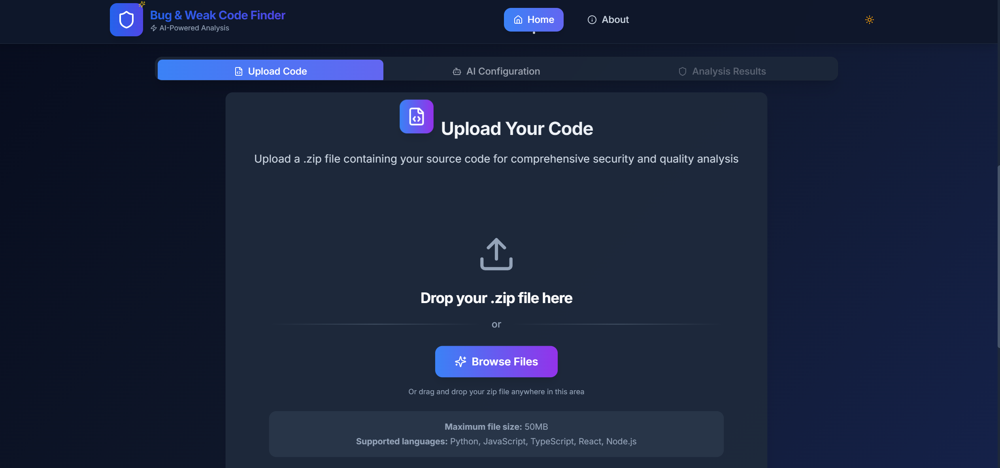

<div align="center">

# 🛡️ Code Guardian v4.5.0
### 🚀 Next-Generation AI-Powered Security Analysis Platform
Enhanced with AI Fix Suggestions, Secure Code Search, and Code Provenance Monitoring

**Current Version: 4.5.0 - Developed by Aditya Kumar Tiwari**
Now with Advanced AI-Powered Security Features


<div align="center">
  
  
  
  
  
  
</div>

<br/>

<div align="center">
  
  
  
  
</div>

<br/>

<div align="center">
  
  
  
  
</div>

**🔬 Advanced AI-powered static code analysis platform that helps developers identify security vulnerabilities, code quality issues, and maintainability concerns in their codebase**

<div align="center">
  <h3>🎯 Transform Your Code Quality Today</h3>
  <p><em>"Security is not a product, but a process" - Bruce Schneier</em></p>
  
  <a href="https://code-guardian-report.vercel.app" target="_blank">
    
  </a>
  <a href="#-quick-start-guide">
    
  </a>
  <a href="#-screenshots--demo">
    
  </a>
</div>

### **🎯 What Code Guardian Does:**

<table>
<tr>
<td width="33%" align="center">
  
  <h4>🛡️ Security Analysis</h4>
  <p>Detects vulnerabilities and security issues using OWASP standards</p>
</td>
<td width="33%" align="center">
  
  <h4>🤖 AI-Powered Insights</h4>
  <p>GPT-4 & Claude integration for intelligent code recommendations</p>
</td>
<td width="33%" align="center">
  
  <h4>📊 Visual Analytics</h4>
  <p>Interactive dashboards with real-time charts and reporting</p>
</td>
</tr>
<tr>
<td width="33%" align="center">
  
  <h4>📈 Quality Assessment</h4>
  <p>Comprehensive code quality scoring and maintainability metrics</p>
</td>
<td width="33%" align="center">
  
  <h4>📤 Export Capabilities</h4>
  <p>Download results in JSON, CSV, PDF, HTML, and XML formats</p>
</td>
<td width="33%" align="center">
  
  <h4>⚡ Lightning Fast</h4>
  <p>Optimized performance with sub-second loading times</p>
</td>
</tr>
</table>

### **✨ New in v4.5.0:**

<div align="center">

| 🆕 Feature | 📝 Description | 🎯 Impact |
|------------|-----------------|------------|
| 🔄 **Version Synchronization** | Updated all version references across the entire project | Consistent versioning and better maintenance |
| 📦 **Dependency Alignment** | Synchronized package.json, manifest, and service worker versions | Improved reliability and deployment consistency |
| 🛠️ **Build Optimization** | Enhanced Vite configuration with advanced chunk splitting | Faster loading and better performance |
| 🖼️ **UI & Accessibility** | UI alignment fixes, accessibility improvements, and documentation updates | Better user experience for all |
| 📤 **Export & PWA** | Improved export formats and PWA manifest actions | Enhanced export and installability |

</div>

Built with ❤️ by [Aditya Kumar Tiwari](https://github.com/Xenonesis)

<div align="center">

**[🌐 Live Demo](https://code-guardian-report.vercel.app) • [📚 Documentation](#-table-of-contents) • [🐛 Report Issues](https://github.com/Xenonesis/code-guardian-report/issues) • [✨ Feature Requests](https://github.com/Xenonesis/code-guardian-report/issues)**

<br/>

<details>
<summary><b>🎥 Watch Demo Video</b></summary>
<br/>
<div align="center">
  
  <p><em>Interactive demo video showcasing key features will be available soon!</em></p>
</div>
</details>

</div>

---

<div align="center">

### **🔗 Quick Links**

[🏠 Home](https://code-guardian-report.vercel.app) • [📖 Docs](#-table-of-contents) • [🚀 Demo](https://code-guardian-report.vercel.app) • [💬 Discussions](https://github.com/Xenonesis/code-guardian-report/discussions) • [📧 Contact](mailto:itisaddy7@gmail.com)

---

<p><em>"Code Guardian - Securing the future, one line at a time."</em></p>


</div>

---

## 📖 Table of Contents

- [✨ Key Features](#-key-features)
- [🏗️ Architecture Overview](#%EF%B8%8F-architecture-overview)
- [🚀 Technology Stack](#-technology-stack)
- [🛠️ Quick Start Guide](#%EF%B8%8F-quick-start-guide)
  - [📋 Prerequisites](#-prerequisites)
  - [⚡ Installation](#-installation)
  - [📜 Available Scripts](#-available-scripts)
  - [🔧 Environment Setup](#-environment-setup)
### 📝 Analysis Tracker Service (v4.0.0+)

- **Persistence:** Uses an in-memory cache for all analysis tracking (no localStorage).
- **API:**
  - `trackFileAnalysis(userId: string): void` — Track a file analysis event for a user.
  - `getTotalFilesAnalyzed(): number` — Get the total number of files analyzed.
  - `getUserAnalysis(userId: string): UserAnalysis | null` — Get analysis stats for a user.
  - `getAllUserAnalytics(): UserAnalysis[]` — Get stats for all users.
- **Note:** All analytics are ephemeral and reset on reload.
- [📱 Usage Guide](#-usage-guide)
- [🎯 Supported Analysis Tools](#-supported-analysis-tools)
- [📸 Screenshots & Demo](#-screenshots--demo)
- [🔧 Configuration](#-configuration)
- [🚀 Deployment](#-deployment)
- [🛡️ Security & Privacy](#-security--privacy)
- [📋 Browser Support](#-browser-support)
- [🔧 Troubleshooting](#-troubleshooting)
- [🤝 Contributing](#-contributing)
- [📊 Performance Metrics](#-performance-metrics)
- [📈 Changelog](#-changelog)
- [🔮 Roadmap](#-roadmap)
- [📄 License](#-license)
- [👤 Author](#-author)
- [🙏 Acknowledgments](#-acknowledgments)
- [📞 Support](#-support)
- [🌟 Show Your Support](#-show-your-support)

---

## ✨ Key Features

<table>
<tr>
<td width="50%">

### 🔍 **Advanced Code Analysis**
- 🛡️ **Security Vulnerability Detection**
  - OWASP Top 10 compliance checking
  - Injection flaw identification
  - Authentication & authorization issues
  - Cryptographic vulnerability detection
- 🔐 **Secret Detection Engine**
  - API key and token detection (AWS, GitHub, Stripe, etc.)
  - JWT token identification and validation
- 🧠 **AI-Powered Fix Suggestions** ⭐ NEW
  - Intelligent vulnerability remediation with multiple approaches
  - Confidence scoring and effort estimation
  - Automated code refactoring capabilities
  - Framework-specific security optimizations
- 🔍 **Secure Code Search Engine** ⭐ NEW
  - Comprehensive database of secure coding patterns
  - Language-specific secure implementations
  - Vulnerability alternatives and best practices
  - Interactive code examples with explanations
- 🛡️ **Code Provenance & Tampering Detection** ⭐ NEW
  - File integrity monitoring with SHA-256 checksums
  - Real-time change detection and alerts
  - Security-critical file identification
  - Comprehensive audit trail and reporting
  - Database credential exposure detection
  - ML-powered entropy analysis for unknown secrets
  - Pattern matching with 95%+ accuracy
- 🐛 **Intelligent Bug Detection**
  - Logic error identification
  - Null pointer exception prevention
  - Memory leak detection
  - Performance bottleneck analysis
- 📏 **Code Quality Assessment**
  - Code smell detection
  - Complexity analysis (Cyclomatic, Cognitive)
  - Maintainability scoring
  - Technical debt calculation

### 🤖 **AI-Powered Intelligence**
- 🧠 **Natural Language Processing**
  - Human-readable issue explanations
  - Context-aware recommendations
  - Smart code suggestions
- 🔗 **Multi-Provider Support**
  - OpenAI GPT-4/GPT-3.5 integration
  - Anthropic Claude support
  - Custom AI model compatibility
- 💡 **Contextual Analysis**
  - Codebase-specific insights
  - Project pattern recognition
  - Historical trend analysis

</td>
<td width="50%">

### 📊 **Rich Analytics Dashboard**
- 📈 **Interactive Visualizations**
  - Real-time charts with Recharts
  - Responsive design across devices
  - Customizable dashboard layouts
- 🎯 **Risk Assessment Matrix**
  - Severity-based issue categorization
  - Security posture scoring
  - Compliance tracking
- 📤 **Advanced Export Options**
  - JSON, CSV, PDF, HTML, XML formats
  - Custom report templates
  - Automated report generation

### 🎨 **Modern User Experience**
- 📱 **Mobile-First Design**
  - Responsive across all screen sizes
  - Touch-optimized interactions
  - Progressive Web App capabilities
- 🌓 **Adaptive Theming**
  - Dark/Light mode with system detection
  - Custom theme creation
  - Accessibility-focused color schemes
- ♿ **Accessibility Excellence**
  - WCAG 2.1 AA compliance
  - Screen reader optimization
  - Keyboard navigation support
  - High contrast mode
- ✨ **Smooth Interactions**
  - Hardware-accelerated animations
  - Glass morphism effects
  - Micro-interactions for better UX

</td>
</tr>
</table>

## 🚀 Technology Stack

<div align="center">

### Core Technologies

| Category | Technology | Version | Purpose |
|----------|------------|---------|---------|
| **Frontend** | React | 18.3.1 | Component-based UI library |
| **Language** | TypeScript | 5.8.3 | Type-safe development |
| **Build Tool** | Vite | 6.3.5 | Lightning-fast bundling |
| **Styling** | Tailwind CSS | 3.4.11 | Utility-first CSS framework |

</div>

### 🎨 **UI & Design System**

- 🎯 **Radix UI**: 12+ accessible, unstyled component primitives (Dialog, Tabs, Toast, etc.)
- 🎨 **shadcn/ui**: Beautiful, customizable component library with dark/light themes
- 🔍 **Lucide React 0.462.0**: 1000+ modern, consistent icons
- ✨ **Tailwind CSS 3.4.11**: Utility-first styling with custom design tokens
- 🌈 **Framer Motion 12.23.0**: Smooth animations and micro-interactions

### 📊 **Data & State Management**

- 📈 **Recharts 2.15.3**: Interactive data visualization and charts
- 🎨 **React Router DOM 6.26.2**: Client-side routing with lazy loading
- 🔄 **React State**: Built-in state management with hooks and context
- 📊 **Vercel Analytics 1.5.0**: Real-time user analytics and insights

### 🛠️ **Development Tools**

- 🎯 **TypeScript 5.8.3**: Advanced type checking and IntelliSense
- 🎨 **PostCSS 8.4.47**: CSS post-processing with autoprefixer
- ⚡ **Vite SWC Plugin 3.5.0**: Ultra-fast React refresh and builds
- 📦 **Advanced Code Splitting**: Intelligent chunk optimization
- 🔧 **Path Aliases**: Clean imports with @ syntax

### 🔧 **Build & Optimization**
- **⚡ Lightning Fast Builds**: Vite 6.3.5 with SWC for sub-second rebuilds
- **📦 Smart Bundling**: Advanced manual chunk splitting for React, Radix UI, and vendor libraries
- **🎯 Performance**: Optimized asset handling with intelligent file naming
- **🔄 Hot Reload**: Instant feedback with HMR overlay during development
- **🗜️ Compression**: Terser optimization with tree shaking and dead code elimination
- **🚀 PWA Ready**: Service worker with advanced caching strategies

## 🛠️ Quick Start Guide

### 📋 Prerequisites

<table>
<tr>
<td width="50%">

**Required:**
- 🟢 **Node.js** v18.0.0+ ([Download](https://nodejs.org/))
- 📦 **Package Manager**: npm, yarn, or bun
- 🌐 **Modern Browser**: Chrome 90+, Firefox 88+, Safari 14+

</td>
<td width="50%">

**Recommended:**
- 💻 **VS Code** with TypeScript extension
- 🔧 **Git** for version control
- 🚀 **Bun** for faster package management

</td>
</tr>
</table>

### ⚡ Installation

<details>
<summary><b>🚀 Option 1: One-Click Deploy (Recommended)</b></summary>

[](https://vercel.com/new/clone?repository-url=https://github.com/Xenonesis/code-guardian-report)
[](https://app.netlify.com/start/deploy?repository=https://github.com/Xenonesis/code-guardian-report)

</details>

<details>
<summary><b>💻 Option 2: Local Development</b></summary>

```bash
# 1️⃣ Clone the repository
git clone https://github.com/Xenonesis/code-guardian-report.git
cd code-guardian-report

# 2️⃣ Install dependencies (choose one)
npm install        # Using npm
yarn install       # Using yarn
bun install        # Using bun (fastest)

# 3️⃣ Start development server
npm run dev        # Using npm
yarn dev           # Using yarn
bun dev            # Using bun

# 4️⃣ Open in browser
# Navigate to http://localhost:5173
```

</details>

### 📜 Available Scripts

| Command | Description | Usage |
|---------|-------------|-------|
| `dev` | Start development server | `npm run dev` |
| `build` | Build for production | `npm run build` |
| `preview` | Preview production build | `npm run preview` |
| `build:production` | Build with production optimizations | `npm run build:production` |
| `type-check` | Run TypeScript type checking | `npm run type-check` |
| `start` | Alias for dev command | `npm start` |
| `serve` | Alias for preview command | `npm run serve` |

### 🔧 Environment Setup

Create a `.env.local` file in the root directory:

```env
# AI Provider Configuration (Optional)
VITE_OPENAI_API_URL=https://api.openai.com/v1
VITE_ANTHROPIC_API_URL=https://api.anthropic.com/v1

# Application Settings
VITE_APP_NAME="Code Guardian Report"
VITE_APP_VERSION="4.5.0"
```

## 📱 Usage Guide

### **🚀 Getting Started in 3 Steps**

<div align="center">

<table>
<tr>
<td width="33%" align="center">
  
  <h4>1️⃣ Upload Code</h4>
  <p>Drag & drop ZIP files or select from your device</p>
  <code>Supports 15+ languages</code>
</td>
<td width="33%" align="center">
  
  <h4>2️⃣ AI Analysis</h4>
  <p>Configure AI providers for enhanced insights</p>
  <code>GPT-4 | Claude | Custom</code>
</td>
<td width="33%" align="center">
  
  <h4>3️⃣ View Results</h4>
  <p>Interactive dashboard with detailed reports</p>
  <code>Export in 5+ formats</code>
</td>
</tr>
</table>

</div>

### **🎯 Key Features Overview**

<div align="center">

| Feature | Description | Supported Formats |
|---------|-------------|-------------------|
| 📁 **File Upload** | Drag & drop ZIP files with intelligent parsing | `.zip`, `.tar.gz`, `.rar` |
| 🔍 **Code Analysis** | Multi-language static analysis engine | `Python`, `JavaScript`, `TypeScript`, `Java`, `C++`, `Go`, `Rust` |
| 🛡️ **Security Scan** | OWASP Top 10 vulnerability detection | `SQL Injection`, `XSS`, `CSRF`, `Auth Issues` |
| 🔐 **Secret Detection** | AI-powered secret and credential detection | `API Keys`, `JWT Tokens`, `DB Credentials`, `Private Keys` |
| 🧠 **AI Fix Suggestions** | Intelligent vulnerability remediation with code patches | `Multiple approaches`, `Confidence scoring`, `Risk assessment` |
| 🔍 **Secure Code Search** | Comprehensive database of secure coding patterns | `Secure examples`, `Vulnerability alternatives`, `Best practices` |
| 🛡️ **Code Provenance** | File integrity monitoring and tampering detection | `SHA-256 checksums`, `Change tracking`, `Alert system` |
| 📊 **Quality Metrics** | Comprehensive code quality assessment | `Complexity`, `Maintainability`, `Technical Debt` |
| 🤖 **AI Insights** | Intelligent recommendations and fixes | `GPT-4`, `Claude-3`, `Gemini`, `Custom Models` |
| 📤 **Export Options** | Multiple export formats for reports | `JSON`, `CSV`, `PDF`, `HTML`, `XML` |

</div>

## 🎯 Supported Analysis Tools

<table>
<thead>
<tr>
<th>Category</th>
<th>Tool</th>
<th>Description</th>
<th>Languages</th>
</tr>
</thead>
<tbody>
<tr>
<td>**Security Analysis**</td>
<td>Bandit</td>
<td>Security vulnerability scanner</td>
<td>Python</td>
</tr>
<tr>
<td></td>
<td>Semgrep</td>
<td>Static analysis for security</td>
<td>Multi-language</td>
</tr>
<tr>
<td></td>
<td>Secret Scanner</td>
<td>AI-powered secret and credential detection</td>
<td>Multi-language</td>
</tr>
<tr>
<td>**Code Quality**</td>
<td>ESLint</td>
<td>Identifies bugs and code quality issues</td>
<td>JavaScript/TypeScript</td>
</tr>
<tr>
<td></td>
<td>Pylint</td>
<td>Comprehensive code quality checker</td>
<td>Python</td>
</tr>
<tr>
<td></td>
<td>Flake8</td>
<td>Style guide enforcement and convention checking</td>
<td>Python</td>
</tr>
</tbody>
</table>

### **🔧 Advanced Tools & Integrations**

<div align="center">

<table>
<tr>
<td width="25%" align="center">
  
  <h5>⚙️ Custom Rules</h5>
  <p>Define specific vulnerability patterns</p>
</td>
<td width="25%" align="center">
  
  <h5>🚦 Configurable</h5>
  <p>Adjust severity levels and rule sets</p>
</td>
<td width="25%" align="center">
  
  <h5>🔗 CI/CD Ready</h5>
  <p>GitHub Actions, Jenkins, GitLab CI</p>
</td>
<td width="25%" align="center">
  
  <h5>🔌 API Access</h5>
  <p>RESTful API for automation</p>
</td>
</tr>
</table>

</div>

## 📸 Screenshots & Demo


*Interactive Mermaid diagram of system flow*

<div align="center">

### 🖥️ **Desktop Experience**

<table>
<tr>
<td width="50%">
  <h4>🏠 Dashboard Overview</h4>
  
  <p><em>Clean, intuitive dashboard with real-time analytics</em></p>
</td>
<td width="50%">
  <h4>🔍 Security Analysis</h4>
  
  <p><em>Comprehensive security vulnerability detection</em></p>
</td>
</tr>
<tr>
<td width="50%">
  <h4>📊 Interactive Charts</h4>
  
  <p><em>Beautiful data visualization with Recharts</em></p>
</td>
<td width="50%">
  <h4>🤖 AI Insights</h4>
  
  <p><em>AI-powered recommendations and insights</em></p>
</td>
</tr>
</table>

### 📱 **Mobile Experience**

<div align="center">
  
  <p><em>Fully responsive design optimized for mobile devices</em></p>
</div>

### 🎨 **Theme Showcase**

<table>
<tr>
<td width="50%" align="center">
  <h4>☀️ Light Mode</h4>
  
</td>
<td width="50%" align="center">
  <h4>🌙 Dark Mode</h4>
  
</td>
</tr>
</table>

</div>

## 🔧 Configuration

### Customization Options
- **Theme Configuration**: Modify `tailwind.config.ts` for custom colors and styles
- **Component Customization**: Update `components.json` for shadcn/ui component paths
- **Analysis Rules**: Configure analysis tool settings in the upload form

## 🚀 Deployment

### Build for Production
```bash
npm run build
```

### Deploy to Popular Platforms

#### **Vercel** (Recommended)
```bash
npm install -g vercel
vercel --prod
```

#### **Netlify**
```bash
npm run build
# Upload dist/ folder to Netlify
```

#### **GitHub Pages**
```bash
npm run build
# Configure GitHub Actions for automatic deployment
```

### Performance Optimizations
- **Code Splitting**: Automatic route-based splitting
- **Lazy Loading**: Components loaded on demand
- **Asset Optimization**: Images and icons optimized for web
- **Caching Strategy**: Service worker integration for offline support

## 🛡️ Security & Privacy

### **Data Protection**
- **Local Processing**: Code analysis performed client-side when possible
- **Secure Transmission**: All API communications use HTTPS
- **No Permanent Storage**: Files automatically deleted after processing
- **Privacy-First**: No tracking or analytics without consent

### **API Key Security**
- **Encrypted Storage**: API keys stored securely in browser
- **No Server Storage**: Keys never transmitted to our servers
- **Easy Management**: Add, remove, and update keys safely
- **Provider Isolation**: Each provider's keys stored separately

## 📋 Browser Support

### **Fully Supported**
- Chrome 90+
- Firefox 88+
- Safari 14+
- Edge 90+

### **Mobile Support**
- iOS Safari 14+
- Chrome Mobile 90+
- Samsung Internet 14+

### **Accessibility Features**
- **WCAG 2.1 AA Compliant**: Full accessibility standards compliance
- **Screen Reader Support**: Optimized for NVDA, JAWS, and VoiceOver
- **Keyboard Navigation**: Complete keyboard accessibility
- **High Contrast**: Support for high contrast mode
- **Reduced Motion**: Respects user motion preferences

## 🤝 Contributing

We welcome contributions! Please follow these steps:

1. **Fork the repository**
2. **Create a feature branch**: `git checkout -b feature/amazing-feature`
3. **Make your changes** and add tests
4. **Run linting**: `npm run lint`
5. **Commit changes**: `git commit -m 'Add amazing feature'`
6. **Push to branch**: `git push origin feature/amazing-feature`
7. **Open a Pull Request**

### Development Guidelines
- Follow TypeScript best practices
- Maintain accessibility standards
- Add tests for new features
- Update documentation as needed
- Follow conventional commit messages

## 📊 Performance Metrics

### **🏆 Performance Metrics**

<div align="center">

#### **Lighthouse Scores**

<table>
<tr>
<td align="center">
  
  <br/><strong>95/100</strong>
</td>
<td align="center">
  
  <br/><strong>98/100</strong>
</td>
<td align="center">
  
  <br/><strong>96/100</strong>
</td>
<td align="center">
  
  <br/><strong>92/100</strong>
</td>
</tr>
</table>

#### **Core Web Vitals**

<table>
<tr>
<td align="center">
  
  <br/><strong>LCP</strong>
  <br/>< 2.5s
</td>
<td align="center">
  
  <br/><strong>FID</strong>
  <br/>< 100ms
</td>
<td align="center">
  
  <br/><strong>CLS</strong>
  <br/>< 0.1
</td>
<td align="center">
  
  <br/><strong>TTI</strong>
  <br/>< 3.8s
</td>
</tr>
</table>

</div>

## 📈 Changelog

### 🔄 Version 4.5.0 - Current Release ⭐
- 🔄 **Version Synchronization**: Updated all version references across the entire project for consistency
- 📦 **Dependency Alignment**: Synchronized package.json, manifest, and service worker versions
- 🛠️ **Build Optimization**: Enhanced Vite configuration with advanced chunk splitting strategies
- 🎯 **TypeScript Updates**: Upgraded to TypeScript 5.8.3 with improved type checking
- 📋 **Documentation**: Updated README.md with current accurate project details and dependencies

See [changelogs.md](./changelogs.md) for the full version history.

## 🔮 Roadmap

<div align="center">

### **🚀 Development Timeline**


*UML Class Diagram of the system*


</div>

<details>
<summary><b>🎯 Detailed Feature Breakdown</b></summary>

### **🌟 Next Release (v3.9.0) - Q1 2025**

<table>
<tr>
<td width="50%">

**🌍 Internationalization**
- [ ] Support for 15+ languages
- [ ] RTL language support
- [ ] Cultural date/time formatting
- [ ] Localized error messages

**📱 Progressive Web App**
- [ ] Offline functionality
- [ ] App-like experience
- [ ] Push notifications
- [ ] Background sync

</td>
<td width="50%">

**🔗 Git Integration**
- [ ] GitHub direct integration
- [ ] GitLab CI/CD support
- [ ] Bitbucket pipelines
- [ ] Automated PR analysis

**👥 Team Features**
- [ ] Shared workspaces
- [ ] Role-based permissions
- [ ] Team analytics
- [ ] Collaborative reports

</td>
</tr>
</table>

### **🚀 Future Releases (v4.6.0+) - 2025 and Beyond**

- 🤖 **AI Model Marketplace**: Integrate and deploy custom AI models
- 🎤 **Voice Commands**: Voice-controlled navigation and file upload
- 🧠 **Custom ML Models**: Project-specific analysis with machine learning
- 🏢 **Enterprise Suite**: SSO, audit logs, compliance reporting
- 🔌 **Plugin Ecosystem**: Extensible architecture for third-party integrations
- 📊 **Predictive Analytics**: Trend forecasting and risk prediction
- 🔒 **Advanced Security**: Zero-trust architecture and enhanced encryption
- 🌐 **Internationalization**: Support for more languages and locales
- 📱 **Mobile App**: Native mobile companion app

</details>

## # Changelog

See [changelogs.md](./changelogs.md) for a complete version history.

**Recent Releases:**
- **v4.5.0 (17/07/2025):** Version bump, synchronized all version references across project
- **v4.4.0 (16/07/2025):** Updates to main.tsx and vite.config.ts, bug fixes
- **v4.3.0–v4.3.3 (12–15/07/2025):** Manifest updates, UI improvements, dependency updates
- **v4.2.0–v4.2.4 (06–10/07/2025):** AI Security Insights, StatsGrid, EnhancedAnalysis updates, bug fixes
- **v4.1.0–v4.1.3 (27/06–03/07/2025):** Build, config, and performance improvements

## 📄 License

This project is licensed under the MIT License. See the [LICENSE](LICENSE) file for details.

## 👤 Author

**Aditya Kumar Tiwari**
- 🎓 BCA in Cybersecurity, Sushant University
- 💼 Cybersecurity Enthusiast | Full-Stack Developer | Lifelong Learner
- 📧 Email: [itisaddy7@gmail.com](mailto:itisaddy7@gmail.com)
- 🐙 GitHub: [@Xenonesis](https://github.com/Xenonesis)
- 💼 LinkedIn: [Aditya Kumar Tiwari](https://linkedin.com/in/itisaddy)
- 📸 Instagram: [@i__aditya7](https://instagram.com/i__aditya7)
- 🌐 Portfolio: [iaddy.netlify.app](https://iaddy.netlify.app)

### 🚀 About the Developer
Passionate about the intersection of cybersecurity and development, Aditya specializes in creating secure and scalable solutions. Currently pursuing BCA in Cybersecurity with expertise in Python, JavaScript, Linux, and Cloud Computing. Committed to building impactful digital experiences that prioritize security and innovation.

## 🙏 Acknowledgments

- **React Team** - For the amazing React framework
- **Vite Team** - For the excellent Vite build tool
- **Tailwind Labs** - For the utility-first CSS framework
- **Radix UI** - For accessible component primitives
- **shadcn** - For the beautiful component library
- **Open Source Community** - For the incredible tools and libraries

## 📞 Support

If you encounter any issues or have questions:

1. **Check the Issues**: [GitHub Issues](https://github.com/Xenonesis/code-guardian-report/issues)
2. **Create a New Issue**: Provide detailed information about your problem
3. **Email Support**: [itisaddy7@gmail.com](mailto:itisaddy7@gmail.com)
4. **Community Discussions**: Join our community discussions

---

## 🌟 Show Your Support

<div align="center">

### **💖 Love Code Guardian? Here's how you can help:**

<table>
<tr>
<td width="25%" align="center">
  <a href="https://github.com/Xenonesis/code-guardian-report/stargazers">
    
    <br/><strong>⭐ Star</strong>
    <br/>Give us a star on GitHub
  </a>
</td>
<td width="25%" align="center">
  <a href="https://github.com/Xenonesis/code-guardian-report/network/members">
    
    <br/><strong>🍴 Fork</strong>
    <br/>Fork and contribute
  </a>
</td>
<td width="25%" align="center">
  <a href="https://github.com/Xenonesis/code-guardian-report/issues">
    
    <br/><strong>🐛 Report</strong>
    <br/>Report bugs & issues
  </a>
</td>
<td width="25%" align="center">
  <a href="https://twitter.com/intent/tweet?text=Check%20out%20Code%20Guardian%20-%20AI-powered%20security%20analysis%20platform!%20https://github.com/Xenonesis/code-guardian-report">
    
    <br/><strong>📢 Share</strong>
    <br/>Spread the word
  </a>
</td>
</tr>
</table>

<br/>

[](https://github.com/Xenonesis/code-guardian-report/stargazers)
[](https://github.com/Xenonesis/code-guardian-report/network/members)
[](https://github.com/Xenonesis/code-guardian-report/watchers)
[](https://github.com/Xenonesis/code-guardian-report/issues)

<br/>


<a href="https://github.com/Xenonesis/code-guardian-report">
  
</a>

</div>
