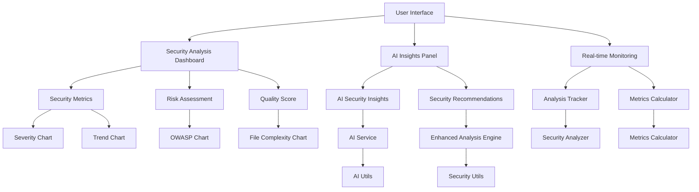

# Project Architecture

## Overview
The project is a comprehensive AI-powered security analysis tool with enhanced visualization and monitoring capabilities. Below is the detailed high-level architecture diagram and key components description.

## Architecture Diagram

## Key Components

### User Interface
- **Description**: Modern UI components for navigation, dashboards, and visualizations.
- **Components**: Navigation, UploadForm, FloatingChatBot, ErrorBoundary

### Security Analysis Dashboard
- **Description**: Central hub for displaying security metrics, risk assessments, and quality scores.
- **Components**: MetricsCards, SeverityChart, TrendChart, OWASPChart

### AI Insights Panel
- **Description**: Provides AI-driven security insights and recommendations.
- **Components**: AISecurityInsights, SecurityRecommendations

### Real-time Monitoring
- **Description**: Tracks and analyzes security metrics in real-time.
- **Components**: AnalysisTracker, MetricsCalculator

### Security Metrics
- **Description**: Visualizes key security metrics using various charts.
- **Components**: SeverityChart, TrendChart, FileComplexityChart

### Risk Assessment
- **Description**: Assesses and visualizes security risks.
- **Components**: RiskAssessment, OWASPChart

### Quality Score
- **Description**: Evaluates and displays the quality score of the analysis.
- **Components**: QualityScoreCard, FileComplexityChart

### AI Service
- **Description**: Core AI service for generating security insights.
- **Components**: AIService, AIUtils

### Enhanced Analysis Engine
- **Description**: Sophisticated analysis engine for detailed security evaluations.
- **Components**: EnhancedAnalysisEngine, SecurityUtils

### Analysis Tracker
- **Description**: Tracks and logs analysis activities.
- **Components**: AnalysisTracker
#### Analysis Tracker (Updated v2.6.0+)
- **Persistence:** Uses an in-memory cache for all analysis tracking (no localStorage or browser storage).
- **API:**
  - `trackFileAnalysis(userId: string): void` — Track a file analysis event for a user.
  - `getTotalFilesAnalyzed(): number` — Get the total number of files analyzed.
  - `getUserAnalysis(userId: string): UserAnalysis | null` — Get analysis stats for a user.
  - `getAllUserAnalytics(): UserAnalysis[]` — Get stats for all users.
  - `resetAnalysisCache(): void` — Reset the in-memory cache (for testing).
- **Testing:** All tests use the in-memory cache and `resetAnalysisCache()` for isolation.
- **Note:** All analytics are ephemeral and reset on reload; no persistent storage is used.

### Metrics Calculator
- **Description**: Calculates various security metrics.
- **Components**: MetricsCalculator

### Security Analyzer
- **Description**: Analyzes security data and generates reports.
- **Components**: SecurityAnalyzer

## Pages and Tools

### Pages
- **Home Page**: Displays the main dashboard with security metrics, risk assessment, and quality score.
- **AI Insights Page**: Provides AI-driven security insights and recommendations.
- **Real-time Monitoring Page**: Tracks and analyzes security metrics in real-time.
- **Upload Page**: Allows users to upload files for security analysis.
- **Settings Page**: Configures user preferences and settings.

### Tools
- **Upload Tool**: Handles file uploads and initial analysis.
- **Analysis Tool**: Performs detailed security analysis on uploaded files.
- **Visualization Tool**: Generates charts and visualizations for security metrics.
- **Reporting Tool**: Creates detailed reports based on the analysis results.
- **Notification Tool**: Sends notifications for completed analyses and critical security issues.

## Detailed Component Interactions

1. **User Interface** interacts with **Security Analysis Dashboard**, **AI Insights Panel**, and **Real-time Monitoring** to provide a seamless user experience.
2. **Security Analysis Dashboard** fetches data from **Security Metrics**, **Risk Assessment**, and **Quality Score** to display comprehensive security analysis.
3. **AI Insights Panel** leverages **AI Service** and **Enhanced Analysis Engine** to provide AI-driven insights and recommendations.
4. **Real-time Monitoring** uses **Analysis Tracker** and **Metrics Calculator** to track and analyze security metrics in real-time.
5. **Security Metrics** visualizes data using various charts like **Severity Chart**, **Trend Chart**, and **File Complexity Chart**.
6. **Risk Assessment** uses **OWASP Chart** to visualize security risks.
7. **Quality Score** evaluates the analysis quality using **Quality Score Card** and **File Complexity Chart**.
8. **AI Service** and **Enhanced Analysis Engine** utilize **AI Utils** and **Security Utils** for advanced analysis and insights.