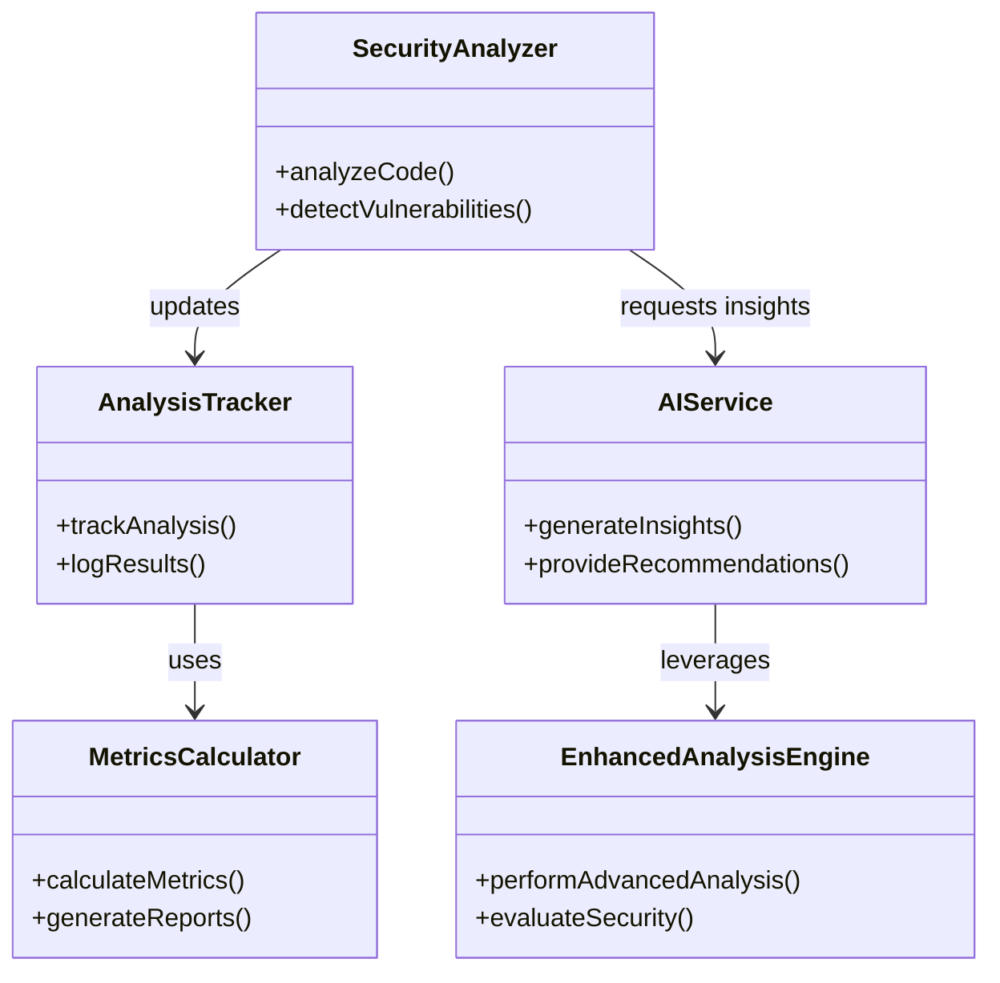

# UML Class Diagram

This diagram represents the core classes and their relationships in the Code Guardian system.

## Key Classes
1. **AnalysisTracker**: Tracks analysis progress and logs results
2. **MetricsCalculator**: Calculates various security metrics and generates reports
3. **SecurityAnalyzer**: Performs code analysis and detects vulnerabilities
4. **AIService**: Provides AI-powered insights and recommendations
5. **EnhancedAnalysisEngine**: Handles advanced security analysis and evaluation