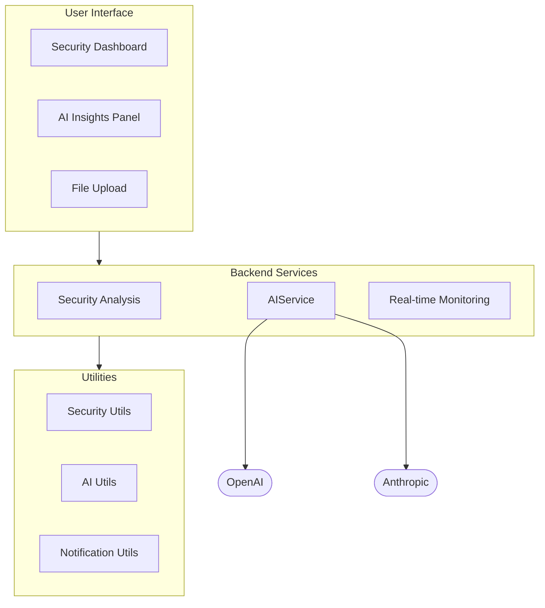

# Component Diagram

This diagram shows the major components of the Code Guardian system and their relationships.

## Key Components
1. **User Interface**: Includes dashboard, insights panel, and file upload components
2. **Backend Services**: Handles core functionality like analysis, AI, and monitoring
3. **Utilities**: Provides reusable security, AI, and notification functionality
4. **External Services**: Integrates with OpenAI and Anthropic AI services

## Relationships
- UI components interact with backend services
- Backend services utilize utility components
- AI service connects to external AI providers