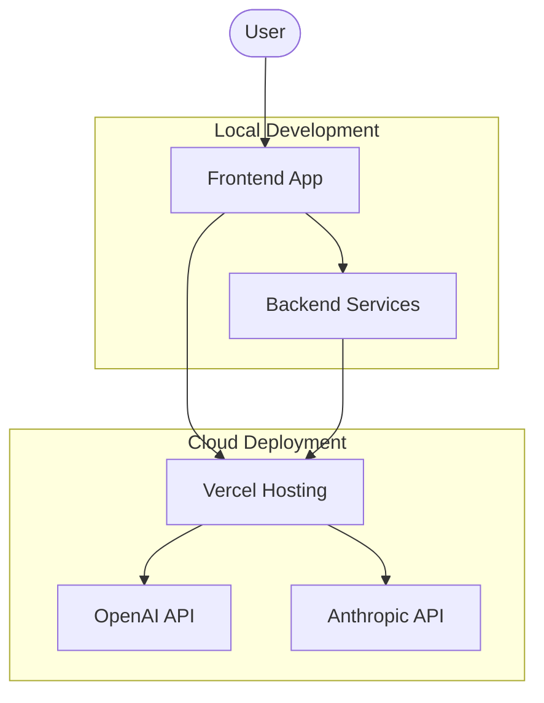

# Deployment Diagram

This diagram shows the deployment architecture of the Code Guardian system, including local development and cloud components.

## Key Components
1. **Local Development**: Includes frontend and backend services for development
2. **Cloud Deployment**: Hosted on Vercel with connections to AI providers
3. **Frontend App**: User interface for interacting with the system
4. **Backend Services**: Core application logic and processing
5. **AI Providers**: External AI services (OpenAI and Anthropic) for insights