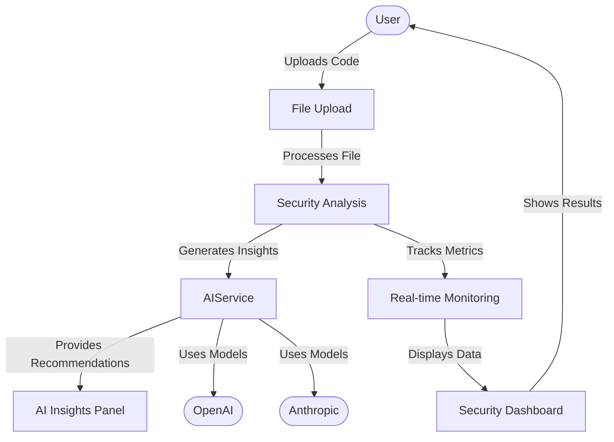

# Data Flow Diagram (DFD)

This diagram shows the flow of data through the Code Guardian system, from user interaction to analysis and back.

## Key Components
1. **User**: Initiates the process by uploading code
2. **File Upload**: Receives and processes uploaded files
3. **Security Analysis**: Performs core security analysis
4. **AIService**: Generates insights using AI models
5. **Real-time Monitoring**: Tracks analysis metrics
6. **Security Dashboard**: Presents results to the user
7. **AI Providers**: External AI services (OpenAI, Anthropic)