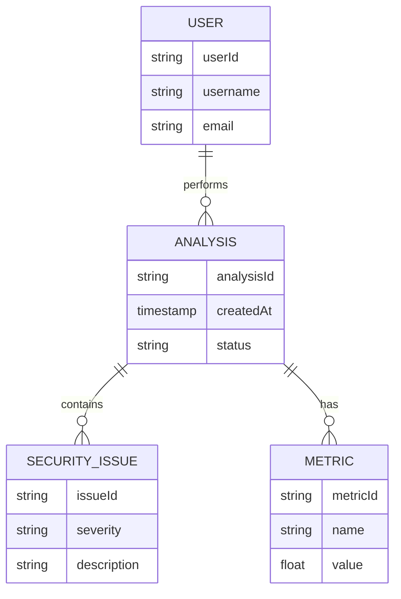

# Entity-Relationship Diagram (ERD)

This diagram shows the relationships between core entities in the Code Guardian system.

## Key Entities
1. **USER**: Represents system users with their details
2. **ANALYSIS**: Tracks each analysis performed by users
3. **SECURITY_ISSUE**: Records security vulnerabilities found in analyses
4. **METRIC**: Stores various metrics calculated during analysis

## Relationships
- A USER performs one or more ANALYSIS
- An ANALYSIS contains zero or more SECURITY_ISSUE
- An ANALYSIS has one or more METRIC