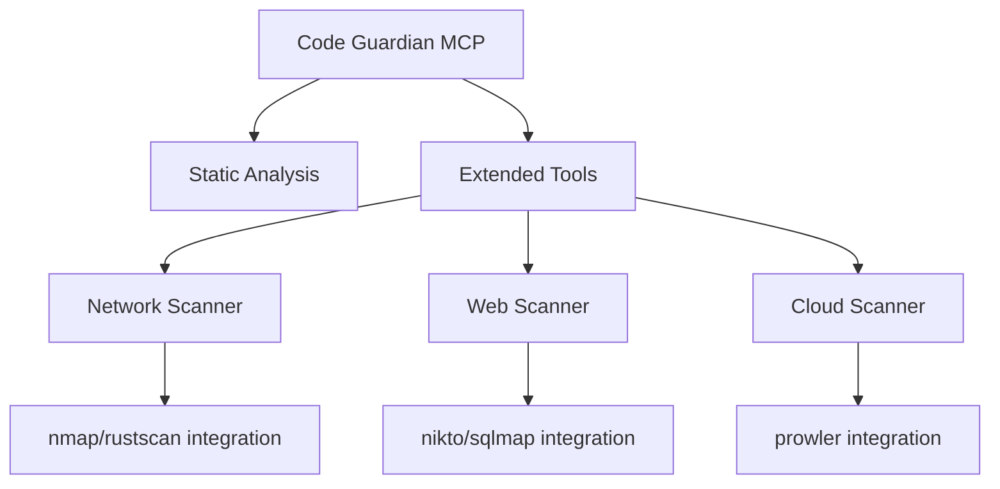

# MCP Pentesting Capabilities Analysis & Implementation Plan

## Executive Summary

This document outlines the current MCP (Model Context Protocol) setup in Code Guardian Report and provides recommendations for achieving comprehensive pentesting capabilities.

---

## Part 1: Current State Analysis

### 1.1 MCP Configuration Files

**Primary Configuration:** [`mcp-config.example.json`](mcp-config.example.json)

The project provides example configurations for multiple MCP clients:
- **Claude Desktop** - macOS/Windows STDIO transport
- **Cursor** - STDIO transport
- **VS Code Copilot** - STDIO transport
- **HTTP/ChatGPT** - Streamable HTTP transport (port 3100)
- **Dev Mode** - Direct TypeScript execution via tsx
- **Inspector** - MCP Inspector UI for debugging

**Key Configuration Details:**
- Server version: 15.0.0
- Transport methods: STDIO + HTTP
- Optional Firebase for persistent memory
- In-memory fallback when Firebase is not configured

### 1.2 MCP Server Architecture

**Location:** [`src/mcp/`](src/mcp/)

```
src/mcp/
├── server.ts              # Main entry point - registers all 19 tools
├── tools/
│   ├── scanner.ts         # 4 tools: file/codebase scanning
│   ├── data-flow.ts      # 1 tool: taint analysis
│   ├── metrics.ts        # 1 tool: code metrics
│   ├── exploit-sim.ts    # 3 tools: attack chain modeling
│   ├── patch-gen.ts      # 3 tools: patch generation
│   ├── validation.ts     # 3 tools: patch verification
│   ├── risk-optimizer.ts # 2 tools: prioritization
│   ├── memory.ts         # 1 tool: session persistence
│   └── pipeline.ts       # 1 tool: end-to-end workflow
├── memory/
│   └── database.ts       # In-memory + Firestore storage
├── resources/            # MCP resources
├── prompts/             # MCP prompts
├── transports/
│   ├── stdio.ts          # STDIO transport
│   └── http.ts           # HTTP transport
└── __tests__/            # Unit tests
```

### 1.3 Current Pentesting Capabilities (19 Tools)

| Category | Tools | Description |
|----------|-------|-------------|
| **Scanner** | `scan_file`, `scan_codebase`, `detect_secrets`, `scan_dependencies` | Static vulnerability detection |
| **Analysis** | `analyze_data_flow`, `calculate_metrics` | Taint tracking & metrics |
| **Exploit Simulation** | `build_exploit_graph`, `simulate_exploit`, `get_attack_paths` | Attack chain visualization |
| **Patch Generation** | `generate_patch`, `preview_patch`, `apply_patch` | Automated remediation |
| **Validation** | `validate_patch`, `run_regression`, `check_confidence` | Fix verification |
| **Risk** | `calculate_risk_score`, `optimize_patches` | CVSS prioritization |
| **Memory** | `query_memory` | Session persistence |
| **Pipeline** | `full_security_pipeline` | Complete workflow |

### 1.4 Security Services

**Analysis Services:** [`src/services/analysis/`](src/services/analysis/)
- `SecurityAnalyzer.ts` (45KB) - AST-based vulnerability detection
- `DataFlowAnalyzer.ts` (19KB) - Taint analysis
- `MultiLanguageSecurityAnalyzer.ts` (34KB) - Multi-language support
- `MetricsCalculator.ts` (18KB) - Code complexity metrics

**Security Services:** [`src/services/security/`](src/services/security/)
- `SecretDetectionService.ts` (27KB) - Hardcoded secrets detection
- `DependencyVulnerabilityScanner.ts` (30KB) - npm vulnerability scanning
- `SecurityAnalysisEngine.ts` (38KB) - Security orchestration
- `ModernCodeScanningService.ts` (40KB) - Modern framework support

### 1.5 Testing Setup

- **Framework:** Vitest
- **Environment:** happy-dom (browser simulation)
- **Test Location:** `src/mcp/__tests__/`
- **Coverage:** Exploit simulation, memory, patch generation, utils

---

## Part 2: Gap Analysis

### 2.1 What Currently Exists ✅

| Capability | Status | Tools |
|------------|--------|-------|
| Static Code Analysis | ✅ Complete | scan_file, scan_codebase |
| Secret Detection | ✅ Complete | detect_secrets |
| Dependency Scanning | ✅ Complete | scan_dependencies |
| Data Flow/Taint Analysis | ✅ Complete | analyze_data_flow |
| Exploit Graph Building | ✅ Complete | build_exploit_graph |
| Exploit Simulation | ✅ Complete | simulate_exploit |
| Attack Path Analysis | ✅ Complete | get_attack_paths |
| Patch Generation | ✅ Complete | generate_patch |
| Patch Validation | ✅ Complete | validate_patch |
| Risk Scoring | ✅ Complete | calculate_risk_score |

### 2.2 What's Missing for Comprehensive Pentesting ❌

The current setup focuses on **static code analysis** (defensive security). For full-spectrum pentesting, the following capabilities are not present:

| Category | Missing Capability | Tools Available in HexStrike |
|----------|-------------------|----------------------------|
| **Network** | Port scanning, network discovery | nmap, rustscan, masscan, arp-scan |
| **Web App** | Vulnerability scanning | nikto, sqlmap, dalfox, xsser, wfuzz |
| **Directory** | Content discovery | dirsearch, feroxbuster, ffuf, gobuster |
| **API** | API security testing | graphql_scanner, jwt_analyzer, api_fuzzer |
| **Cloud** | Cloud security assessment | prowler, scout_suite, cloudmapper |
| **Container** | Container scanning | trivy, clair, docker_bench_security |
| **Kubernetes** | K8s security | kube_hunter, kube_bench |
| **Binary** | Binary exploitation | pwntools, ghidra, radare2 |
| **Credentials** | Password attacks | hashcat, john, hydra |
| **Memory** | Memory forensics | volatility3 |

---

## Part 3: Implementation Recommendations

### Option A: Integrate HexStrike MCP (Recommended)

The HexStrike MCP server is already connected to your environment. You can leverage it directly by:

1. **Adding HexStrike to MCP Configuration**

```json
{
  "mcpServers": {
    "code-guardian": {
      "command": "python",
      "args": ["C:\\Users\\addy\\hexstrike-ai\\hexstrike_mcp.py"]
    }
  }
}
```

2. **Using Both Servers Together**
   - Code Guardian: Static code analysis, secrets, dependencies
   - HexStrike: Network scanning, web vulnerabilities, cloud security

### Option B: Extend Code Guardian MCP

Create new tools in [`src/mcp/tools/`](src/mcp/tools/) to add offensive capabilities:



---

## Part 4: Recommended Action Items

### Priority 1: Quick Wins
- [ ] Document how to use HexStrike alongside Code Guardian
- [ ] Add MCP configuration examples for combined usage
- [ ] Create integration guide showing defensive + offensive workflow

### Priority 2: Enhancement
- [ ] Add new MCP tools for common pentest scenarios
- [ ] Create unified workflow: Code Guardian scan → HexStrike exploitation

### Priority 3: Advanced
- [ ] Build unified dashboard combining both MCP servers
- [ ] Create automated red team workflows

---

## Appendix: HexStrike Tools Reference

### Network Scanning
- `nmap_scan` / `nmap_advanced_scan`
- `rustscan_fast_scan`
- `masscan_high_speed`
- `arp_scan_discovery`

### Web Application
- `nikto_scan`
- `sqlmap_scan`
- `dalfox_xss_scan`
- `xsser_scan`
- `dirsearch_scan`
- `feroxbuster_scan`

### API Security
- `graphql_scanner`
- `jwt_analyzer`
- `api_fuzzer`
- `comprehensive_api_audit`

### Cloud Security
- `prowler_scan`
- `scout_suite_assessment`
- `cloudmapper_analysis`

### Binary Exploitation
- `pwntools_exploit`
- `ghidra_analysis`
- `radare2_analyze`
- `checksec_analyze`

---

*Generated: 2026-03-15*
*Project: Code Guardian Report v15.0.0*
